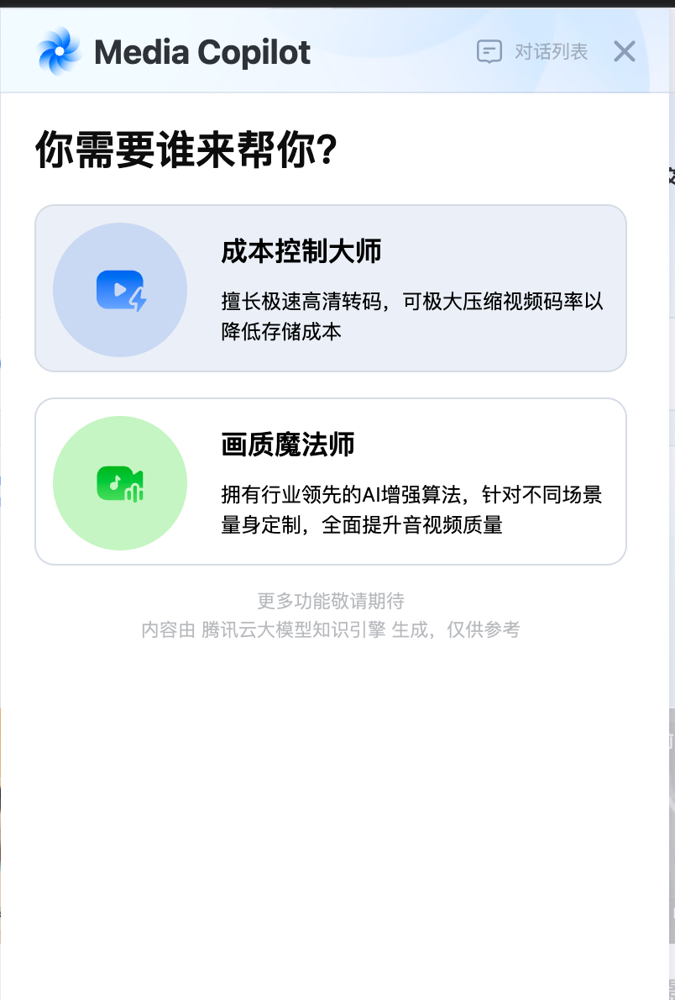

<!-- toc -->

- [自我介绍](#自我介绍)
- [项目介绍](#项目介绍)
  - [一、mps媒体处理控制台](#一mps媒体处理控制台)
    - [1、MPS Media copilot （ai助手） 2024.4-2024.7](#1mps-media-copilot-ai助手-20244-20247)
      - [一、EventBus](#一eventbus)
        - [1.主要作用](#1主要作用)
        - [2.设计特点](#2设计特点)
        - [3.使用场景示例](#3使用场景示例)
        - [4.优势总结](#4优势总结)
      - [二、mobx-state-tree](#二mobx-state-tree)
        - [1、整体架构概述](#1整体架构概述)
        - [2、设计模式分析](#2设计模式分析)
        - [3、业务场景应用](#3业务场景应用)
        - [4、技术优势](#4技术优势)
    - [2、视频评测（转码评测、BD-Rate评测） 2024.1-2024.3](#2视频评测转码评测bd-rate评测-20241-20243)
      - [一、同屏对比工具](#一同屏对比工具)
    - [3、字幕压制 2025.6-2025.8](#3字幕压制-20256-20258)
      - [一、svg字幕渲染](#一svg字幕渲染)
      - [二、缩放和拖拽字幕](#二缩放和拖拽字幕)
    - [4、AIGC 2025.11](#4aigc-202511)
  - [二、独立站 体验馆](#二独立站-体验馆)
    - [1、高光 2025.1-2025.2](#1高光-20251-20252)
    - [一、VideoLight高光时刻组件](#一videolight高光时刻组件)
    - [2、擦除](#2擦除)
    - [3、声音克隆](#3声音克隆)
    - [4、播放器](#4播放器)
  - [三、 运营系统](#三-运营系统)
  - [四、枝桠](#四枝桠)

**自我介绍+项目介绍**

# 自我介绍

面试官好，我叫詹圆圆，是23届的毕业生，在校的专业是计算机科学与技术。很高兴可以在这面试，我想应聘前端开发工程师这个职位。目前在腾讯云计算有限公司工作，是在职状态。我所在的部门的业务是音视频处理，我主要做的是媒体处理（mps）控制台和独立站体验馆，对音视频进行相关的处理，比如压制字幕，视频评测等，控制台的流程就是首先创建需要的模板，比如增强模板，字幕擦除模板等，然后创建服务编排，关联模板以及触发Bucket等，再创建任务。


# 项目介绍

## 一、mps媒体处理控制台
控制台地址：
- 国内站：https://console.cloud.tencent.com/mps
- 国际站：https://console.tencentcloud.com/mps

控制台的项目用的ui组件库是tea-component，是一个基于 React 的 UI 组件库。
- 内部的地址： https://tea.tencent.com/component
- 外部的地址：https://tea-design.github.io/component


### 1、MPS Media copilot （ai助手） 2024.4-2024.7


目的：不熟悉控制台的用户使用起来比较麻烦，用copilot可以快速的创建极速高清转码任务和增强任务。（肯定是有局限性的）主要还是为了让客户清楚控制台的功能，处理视频的效果。

功能：控制台概览页面新增media copilot入口,分为成本控制大师和画质魔法师两个模块，点击打开media copilot，以小窗浮层模式打开。浮层位置默认在页面右侧，浮层高度自适应页面高度。可以拖拽移动。
```tsx
import { useChat } from '@src/hooks/useChat';
import { rootStore } from '@src/store';
import eventBus from '@src/utils/event-bus';
import { SlideTransition } from '@tencent/tea-component';
import { observer } from 'mobx-react-lite';
import React, { useEffect, useState } from 'react';
import ReactDOM from 'react-dom';
import { ChatView } from './component/ChatView';
import { DragCopilotPanel } from './component/DragCopilotPanel';
import { ChatHeader } from './view/ChatHeader';
import { SessionList } from './view/SessionList';

let mounted = false; // 页面是否加载

/**
 * MPS Media Copilot 入口组件
 */
const Index = () => {
  const {
    copilotVisible,
    conversations,
    conversation,
    sessionType,
    selectedId,
    isSessionListExpanded,
    loading,
    toggleCopilotVisible,
    setSessionListExpandedStatus,
  } = rootStore.copilot;
  const chat = useChat();
  const [shouldRender, setShouldRender] = useState(true); // 当visible为false时，应该等待过渡效果结束才卸载组件

  /**
   * 当展示会话列表时，通过事件冒泡触发点击其他区域隐藏列表
   */
  useEffect(() => {
    const toggleSessionListVisible = (event: MouseEvent) => {
      if (!isSessionListExpanded || !mounted) return;
      const copilot = document.querySelector('.app-mps-media-copilot-rect-container');
      const sessionListContainer = document.querySelector('.app-mps-session-list-container');
      if (!copilot || !sessionListContainer) return;
      if (!copilot.contains(event.target as Node)) return;
      if (!sessionListContainer.contains(event.target as Node)) {
        setSessionListExpandedStatus(false);
        return;
      }
    };

    document.addEventListener('click', toggleSessionListVisible);

    return () => {
      document.removeEventListener('click', toggleSessionListVisible);
    };
  }, [isSessionListExpanded]);

  useEffect(() => {
    // init
    chat.initSession();
    mounted = true;

    return () => {
      mounted = false;
      eventBus.clear();
    };
  }, []);

  return (
    <>
      {shouldRender &&

        ReactDOM.createPortal(
          <div className="app-mps-meida-copilot-widget" style={{ position: 'fixed', top: 0, zIndex: 999 }}>
            <SlideTransition in={copilotVisible} from={[50, 0]} timeout={200} onExited={() => setShouldRender(true)}>
              <div>
                <DragCopilotPanel visible={copilotVisible} disableDragged={isSessionListExpanded || loading}>
                  <div className="app-mps-media-copilot">
                    <ChatHeader onClose={() => toggleCopilotVisible(false)} />
                    <ChatView
                      conversation={conversation}
                      type={sessionType}
                      selectedId={selectedId}
                      loading={loading}
                    />
                    {/* 全局loading浮层 */}
                    <div className="loading-overlay" style={{ display: loading ? 'flex' : 'none' }}>
                      <svg className="loading-spinner" viewBox="0 0 50 50">
                        <circle className="path" cx="25" cy="25" r="20" fill="none" strokeWidth="5" />
                      </svg>
                    </div>
                    {/* 会话列表 */}
                    <SessionList
                      selectedId={selectedId}
                      conversations={conversations}
                      sessionListVisible={isSessionListExpanded}
                    />
                  </div>
                </DragCopilotPanel>
              </div>
            </SlideTransition>
          </div>,
          document.body,
        )}
    </>
  );
};

/**
 * MPS Media Copilot 入口组件
 */
export default observer(Index);

```
ReactDOM.createPortal：**将React组件渲染到DOM树中的不同位置，而不受组件层次结构的限制。**
还保持**React特性**：
- 组件仍然在React的组件树中
- 可以正常接收props和触发事件
- 事件冒泡会按照React组件树的结构进行
使用场景：
适合使用Portal的情况：
- 模态框（Modal）
- 工具提示（Tooltip）
- 下拉菜单（Dropdown）
- 通知消息
- 悬浮聊天窗口
不适合使用Portal的情况：
- 普通的布局组件
- 需要与父组件紧密耦合的组件

ReactDOM.createPortal(children, container)
- children: 要渲染的React元素
- container: DOM元素，作为渲染的目标容器

```tsx
ReactDOM.createPortal(
  <div className="app-mps-meida-copilot-widget" style={{ position: 'fixed', top: 0, zIndex: 999 }}>,
  document.body
)
// 直接挂载到document.body，不受父组件CSS样式的影响，拥有最高的z-index层级，可以覆盖页面上的其他元素
```

用SlideTransition包裹，实现浮窗的显示/隐藏动画效果。（`SlideTransition`是一个基于`react-transition-group`的滑动过渡动画组件，用于实现元素的滑入滑出动画效果。）
- in 进入退出状态
- form: 从哪个位置进入，相对 DOM 本身的位置 [x, y]。默认为 [0, -30]
- to: 消失到哪个位置，默认和 from 相等
- timeout 动画时间
- onExited 推出状态回调
```js
  <SlideTransition 
  in={copilotVisible}
  from={[50, 0]} // 从右侧50px位置滑入
  timeout={200} // 动画时间200ms
  onExited={() => setShouldRender(true)}
>
</SlideTransition>
```
DragCopilotPanel是可拖拽可调整宽高面板的组件，里面用的是react-rnd的Rnd组件，
```tsx
import React, { useEffect, useState, useRef } from 'react';
import { Rnd } from 'react-rnd';
import DragPanelRect from '../utils/DragRect';// 面板拖拽 + 调整宽高计算类
import { useSessionStorage } from '@src/hooks/session-storage';
import { RectWithPositon } from '../interface';

interface DragCopilotPanelProps {
  /**
   * 弹窗 visible
   */
  visible: boolean;
  /**
   * 用于控制是否允许拖拽
   */
  disableDragged?: boolean;
}

// 用于面板拖拽调整大小计算
const dragPanelRect = new DragPanelRect();

/**
 * 可拖拽可调整宽高面板
 */
export const DragCopilotPanel: React.FC<DragCopilotPanelProps> = ({ visible, disableDragged = false, ...props }) => {
  const defaultRect = dragPanelRect.getDefaultRect();
  const [floatSize, setFloatSize] = useState(defaultRect.size);
  const [floatPosition, setFloatPosition] = useState(visible ? { x: 0, y: 0 } : defaultRect.position);
  const [isVerticalMax, setIsVerticalMax] = useState(false);
  const [canDrag, setCanDrag] = useState(!disableDragged);
  const [storedRect, setStoredRect] = useSessionStorage<RectWithPositon>('MPS_COPILOT_RECT', {});
  const floatRect = useRef({
    position: defaultRect.position,
    size: defaultRect.size,
  });
  const screenSize = useRef({ width: window.innerWidth, height: window.innerHeight });

  const adjustPosition = () => {
    // 获取当前的位置及宽高
    const {
      position: { x: currentLeft, y: currentTop },
      size,
    } = floatRect.current;
    const { width, height } = screenSize.current;
    // 获取当前屏幕的大小
    const windowWidth = window.innerWidth;
    const windowHeight = window.innerHeight;
    // 计算新的位置比例
    const leftRatio = currentLeft / width;
    const topRatio = currentTop / height;
    // 根据新的窗口大小计算新的left和top
    const newLeft = Math.floor(leftRatio * windowWidth);
    const newTop = Math.floor(topRatio * windowHeight);
    // 外层容器
    const container: HTMLDivElement = document.querySelector('.app-mps-media-copilot-rect-container');
    const isMix = windowHeight < size?.height;
    const mixHeight = Math.floor(windowHeight - 50);
    container.style.height = isMix ? `${mixHeight}px` : '101%';
    setFloatPosition({ x: newLeft, y: isMix ? 50 : newTop });
    isMix && dragPanelRect.setPrevSize({ ...size, height: mixHeight });
    floatRect.current = { position: { x: newLeft, y: newTop }, size };
    screenSize.current = { width: windowWidth, height: windowHeight };
  };

  useEffect(() => {
    if (!visible) return;
    setFloatPosition(storedRect?.position || defaultRect.position);
    setFloatSize(storedRect?.size || defaultRect.size);
    if (storedRect?.position) floatRect.current = storedRect;
    window.addEventListener('resize', adjustPosition);

    return () => {
      window.removeEventListener('resize', adjustPosition);
    };
  }, []);

  useEffect(() => {
    setCanDrag(!disableDragged);
  }, [disableDragged]);

  return (
    <Rnd
      style={{ pointerEvents: visible ? 'all' : 'none', zIndex: 101 }}
      position={floatPosition}
      size={floatSize}
      maxWidth={1024}
      maxHeight={1024}
      minWidth={DragPanelRect.minWidth}
      minHeight={DragPanelRect.minHeight}
      disableDragging={!canDrag}
      onResizeStart={() => setCanDrag(false)}
      onResizeStop={(_e, _direction, ref, _delta, position) => {
        setCanDrag(true);
        const currentRect = dragPanelRect.getRectByResize(position, {
          width: parseInt(ref.style.width, 10),
          height: parseInt(ref.style.height, 10),
        });
        setFloatPosition(currentRect.position);
        setFloatSize(currentRect.size);
        floatRect.current = currentRect;
        setStoredRect(currentRect);
        setIsVerticalMax(currentRect.size?.height === DragPanelRect.maxHeight);
      }}
      onDragStop={(_e, data) => {
        if (!canDrag) return setCanDrag(true);
        const currentRect = dragPanelRect.getRectByPosition(data, isVerticalMax);
        setFloatSize(currentRect.size);
        setFloatPosition(currentRect.position);
        floatRect.current = currentRect;
        setStoredRect(currentRect);
      }}
    >
      <div className="app-mps-media-copilot-rect-container">{props?.children}</div>
    </Rnd>
  );
};

```
utils/DragRect
```ts
import { PositionData, SizeData } from '../interface';

/**
 * 面板拖拽 + 调整宽高计算类
 */
export default class DragPanelRect {
  public static minHeight = 700; // 面板最小高度
  public static minWidth = 400; // 面板最小宽度
  public static maxHeight = 1024; // 面板最大高度
  public static maxWidth = 1024; // 面板最大宽度
  public static defaultTopOffset = 70; // 默认y轴偏移量
  public static topOffset = 50; // y轴偏移量
  public static defaultRightOffset = 70; // 默认右边距
  public static rightOffset = 0; // 右侧偏移量
  public static defaultBottomOffset = 150; // 默认情况下距底高度
  public static bottomOffset = 0; // 面板移动之后底部边距
  // 面板默认size
  public static defaultSize = {
    width: 400,
    height: 700,
  };
  // tips: 面板全屏size，第一期不做全屏，预留逻辑
  public static fullscreenSize = {
    width: 1024,
    height: 700,
  };
  public prevSize: SizeData = DragPanelRect.defaultSize; // 存储上一次拖拽时面板size
  private prevPosition: PositionData; // 存储上一次拖拽时面板位置

  /**
   * 获取初始状态
   */
  getDefaultRect() {
    const winWidth = window.innerWidth;
    const winHeight = window.innerHeight;

    const width = Math.min(winWidth - DragPanelRect.defaultRightOffset, DragPanelRect.defaultSize.width);
    const height = Math.min(
      winHeight - DragPanelRect.defaultBottomOffset - DragPanelRect.defaultTopOffset,
      DragPanelRect.defaultSize.height,
    );
    const position = {
      x: winWidth - width - DragPanelRect.defaultRightOffset,
      y: winHeight - height - DragPanelRect.defaultBottomOffset,
    };

    return { size: { width, height }, position };
  }

  /**
   * 设置计算尺寸
   * @param size 尺寸
   */
  setPrevSize(size: SizeData) {
    this.prevSize = size;
  }

  /**
   * 点击全屏按钮
   * tips: 第一期不做，预留逻辑
   */
  getFullScreenRect() {
    const winWidth = window.innerWidth;
    const winHeight = window.innerHeight;

    const width = winWidth * 0.8;
    const height = winHeight * 0.8;
    const position = {
      x: (winWidth - width) / 2,
      y: (winHeight - height) / 2,
    };

    this.prevSize = { width, height };
    this.prevPosition = position;

    return { size: { width, height }, position };
  }

  /**
   * 垂直方向全屏
   * ti[s: 第一期不做，预留
   */
  getVerticalMaxRect() {
    const winWidth = window.innerWidth;
    const winHeight = window.innerHeight;
    const height = winHeight - DragPanelRect.topOffset;
    const { width } = DragPanelRect.defaultSize;
    const position = {
      x: winWidth - width,
      y: DragPanelRect.topOffset,
    };

    return {
      size: { width, height },
      position,
    };
  }

  /**
   * 拖动时获取实时面板size以及位置
   * @param windowIsResize 当前是否拖动
   */
  getRectByWindowResize(windowIsResize = false) {
    const winWidth = window.innerWidth;
    const winHeight = window.innerHeight;
    let { x, y } = this.prevPosition;
    y = Math.max(y, DragPanelRect.topOffset);

    const getMaxHeight = () =>
      Math.max(DragPanelRect.minHeight, Math.min(winHeight - y - DragPanelRect.bottomOffset, DragPanelRect.maxHeight));

    let { width, height } = this.prevSize;
    if (DragPanelRect.rightOffset + x + width > winWidth) {
      if (x > 0) {
        x = Math.max(winWidth - width - DragPanelRect.rightOffset, 0);
      } else {
        width = Math.max(
          DragPanelRect.minWidth,
          Math.min(winWidth - DragPanelRect.rightOffset, DragPanelRect.maxWidth),
        );
      }
    }

    if (y + height + DragPanelRect.bottomOffset > winHeight) {
      if (y > DragPanelRect.topOffset) {
        y = Math.max(DragPanelRect.topOffset, winHeight - height - DragPanelRect.bottomOffset);
      } else {
        height = Math.max(
          DragPanelRect.minHeight,
          Math.min(winHeight - DragPanelRect.topOffset - DragPanelRect.bottomOffset, DragPanelRect.maxHeight),
        );
      }
    } else {
      height = windowIsResize
        ? getMaxHeight()
        : Math.min(height, winHeight - DragPanelRect.bottomOffset - DragPanelRect.topOffset);
    }

    return { size: { width, height }, position: { x, y } };
  }

  /**
   * 当面板尺寸不变，只调整位置时，获取面板位置
   * @param position 拖动之后的位置
   * @param isVerticalMaximum 当前是否是垂直最大化
   */
  getRectByPosition(position: PositionData, isVerticalMaximum = false) {
    const winWidth = window.innerWidth;
    const winHeight = window.innerHeight;
    const { width, height } = this.prevSize;

    this.prevPosition = {
      x: Math.min(Math.max(0, position.x), winWidth - width - DragPanelRect.rightOffset),
      y: isVerticalMaximum
        ? 0
        : Math.min(Math.max(0, DragPanelRect.topOffset, position.y), winHeight - height - DragPanelRect.bottomOffset),
    };

    return { size: { width, height }, position: this.prevPosition };
  }

  /**
   * 当面板位置不变，只调整大小时，获取面板size以及positon
   * @param pos 当前面板position
   * @param s 当前面板size
   */
  getRectByResize(pos = null, s = null) {
    this.prevSize = s || this.prevSize;
    this.prevPosition = pos || this.prevPosition;

    const { size, position } = this.getRectByWindowResize();
    this.prevSize = size;
    this.prevPosition = position;
    return { size, position };
  }

  /**
   * 获取当前存储的最新的size以及position
   */
  getRect() {
    return { position: this.prevPosition, size: this.prevSize };
  }

  /**
   * 设置size以及postion
   * @param position 面板position
   * @param size 面板size
   */
  setRect(position: PositionData, size: SizeData) {
    this.prevPosition = position || this.prevPosition;
    this.prevSize = size || this.prevSize;
  }

  /**
   * 重置面板size
   */
  resetSize() {
    this.prevSize = DragPanelRect.defaultSize;
  }

  /**
   * 重置面板position
   */
  resetPosition() {
    const winWidth = window.innerWidth;
    const winHeight = window.innerHeight;
    const { height, width } = this.prevSize;

    this.prevPosition = {
      x: winWidth - width - DragPanelRect.defaultRightOffset,
      y: winHeight - height - DragPanelRect.defaultBottomOffset,
    };
  }

  /**
   * 重置布局
   */
  resetRect() {
    this.resetSize();
    this.resetPosition();
  }
}

```
#### 一、EventBus
EventBus（事件总线）是一个实现**发布订阅模式**的事件管理系统，主要用于**组件间的通信和解耦**。

##### 1.主要作用
1. 组件间解耦：
- 不同组件之间不需要直接引用或导入对方
- 通过事件进行通信，降低组件间的依赖关系
- 便于维护和扩展
2. 跨层级通信
- 解决React中props drilling问题（指的就是把组件 A 的数据（props）逐层传递给它的子组件 B、再传给 B 的子组件 C……，直到最底层的某个深层组件才能使用到这份数据。）
- 任意层级的组件都可以直接通信
- 特别适合兄弟组件、祖孙组件间的通信
3. 异步通信支持
- 事件发布和订阅是异步的
- 支持一对多的通信模式

##### 2.设计特点
1. 单例模式
```ts
const SingleEventBus = sington(EventBus);
export default new SingleEventBus(); 
```
- 全局只有一个EventBus实例
- 所有组件共享同一个事件总线
2. 类型安全
```ts
type Listener<T> = (data: T) => void; 
```
- 支持TypeScript类型检查
- 确保事件数据的类型安全
3. 内存管理
```ts
public off<T>(event: string, listener: Listener<T>): void 
```
- 提供取消订阅功能
- 避免内存泄漏

##### 3.使用场景示例

场景1：用户操作通知
```ts
// 组件A：发布用户选择事件
eventBus.emit('userSelected', { userId: 123, userName: '张三' });

// 组件B：订阅用户选择事件
eventBus.on('userSelected', (userInfo) => {
  // 更新用户信息显示
}); 
```

场景2：全局状态变化
```ts
// 发布登录状态变化
eventBus.emit('loginStatusChanged', { isLoggedIn: true });

// 多个组件订阅登录状态
eventBus.on('loginStatusChanged', (status) => {
  // 更新界面显示
}); 
```
场景3：一次性事件
```ts
// 订阅一次性初始化事件
eventBus.once('appInitialized', () => {
  // 只执行一次的初始化逻辑
});
```
当前项目里用到的地方: 上传示例视频、提供URL、切换对话

**上传示例视频：**
```tsx
// 1. 事件发布方：ChatHistoryItem.tsx 点击 使用示例视频
const useExampleMedia = async () => {
  try {
    eventBus.emit('uploadSample', true); // 开始上传，通知显示返回按钮
    chat.setLoading(true); // 设置加载状态
    const { region, bucket, path } = await fetchDescribeSampleMedias(type);  //  调用API获取示例媒体信息
    chat.setLoading(false); // 设置加载状态
    eventBus.emit('uploadSample', false);// 上传完成，通知隐藏返回按钮
    ...
  } catch (err) {
    app.tips.error({ message: t('使用示例视频失败，请稍后重试') });
  } finally {
    chat.setDisable(false);
  }
};
// 2. 事件订阅方：ChatHistory.tsx
useEffect(() => {
  // 订阅事件
  const uploadSample = (status: boolean) => {
    showBackIcon.current = status;  // 控制返回按钮显示状态
  };
  eventBus.on('uploadSample', uploadSample);

  return () => {
    eventBus.off('uploadSample', uploadSample);  // 清理订阅
  };
}, []);
// 3. UI状态控制
return (
  <section className="app-mps-media-copilot_history-container" ref={containerRef}>
    {(!loading || showBackIcon.current) && (  // 显示条件：非加载状态或正在上传示例, 确保用户在上传过程中也能返回
      <div className="session-container-header-goback" onClick={goback}>
        <ArrowLeftStrokeIcon size={14} />
        <MPSIcon name="goback" width={36} />
      </div>
    )}
  </section>
); 
```

**提供URL:**
```tsx
// 1. 事件发布方：ChatHistoryItem.tsx / ChatHistory.tsx
// ChatHistoryItem.tsx
const offerUrl = () => {
  if (!isCosAuth) return camCosAuth();  // 检查COS认证
  eventBus.emit('offerUrl', true);     // 触发URL上传模式
};

const uploadMedia = (type: string) => {
  eventBus.emit('offerUrl', false);    // 先关闭URL上传模式
  chat.setDisable(type !== 'url');     // 设置输入框禁用状态
  
  if (type === 'cos') return uploadCosMedia();    // COS上传
  if (type === 'url') return offerUrl();          // URL上传
  if (type === 'example') return useExampleMedia(); // 示例媒体上传
};
/* uploadMedia函数逻辑：
    无论选择哪种上传方式，都先发送offerUrl(false)关闭URL模式
    根据type参数决定具体操作：
    - cos: COS对象存储上传
    - url: 触发URL上传模式
    - example: 使用示例媒体
  */

 // ChatHistory.tsx
const goback = () => {
  chat.goBack();
  eventBus.emit('offerUrl', false); // 确保状态一致性
}; 

 // 2. 事件订阅方：ChatInput.tsx
 useEffect(() => {
  const offerUrl = (status: boolean) => {
    changeOfferUrlStatus(status);  // 更新URL上传状态
    // 如果是URL模式且输入框未聚焦，自动聚焦
    if (textareaRef.current !== document.activeElement && status) 
      textareaRef.current?.focus();
  };

  // 订阅事件
  eventBus.on('offerUrl', offerUrl);

  return () => {
    // 清理订阅
    eventBus.off('offerUrl', offerUrl);
  };
}, []);
/*
  offerUrl事件处理：
  status=true: 进入URL上传模式，自动聚焦输入框
  status=false: 退出URL上传模式
*/
```

**切换对话：**
```tsx
  // 1. 事件发布方：SessionList.tsx
  const onSelect = (id: string, type: SessionType) => {
    if (!id || !type) return;
    
    selectSession(type);              // 选择会话类型
    selectId(id);                    // 选择会话ID
    changeSessionListVisible(false);  // 隐藏会话列表
    eventBus.emit('switchChat');     // 通知切换会话
  };
  // 2. 事件订阅方：ChatInput.tsx
  useEffect(() => {
    const switchChat = () => {
      setValue('');              // 清空输入框内容
      changeOfferUrlStatus(false); // 关闭URL上传模式
      setIsError(false);        // 清除错误状态
    };

    // 订阅事件
    eventBus.on('switchChat', switchChat);

    return () => {
      // 清理订阅
      eventBus.off('switchChat', switchChat);
    };
  }, []);
```
##### 4.优势总结
1. 解耦性强：组件间不直接依赖，通过事件通信
2. 灵活性高：支持动态添加/移除事件监听
3. 扩展性好：新组件可以轻松接入现有事件系统
4. 维护简单：事件逻辑集中管理，便于调试

```ts
type Listener<T> = (data: T) => void;
type Constructor<T> = new (...args: any[]) => T;

class EventBus {
  // events
  private events: Map<string, Array<Listener<any>>>;

  public constructor() {
    this.events = new Map();
  }

  /**
   * 订阅事件
   */
  public on<T>(event: string, listener: Listener<T>): void {
    if (!this.events.has(event)) {
      this.events.set(event, []);
    }
    this.events.get(event)!.push(listener);
  }

  /**
   * 订阅一次性事件
   */
  public once<T>(event: string, listener: Listener<T>): void {
    const wrapper: Listener<T> = (data: T) => {
      listener(data);
      // 自动取消订阅
      this.off(event, wrapper);
    };
    this.on(event, wrapper);
  }

  /**
   * 发布事件
   */
  public emit<T>(event: string, data?: T): void {
    if (this.events.has(event)) {
      const listeners = this.events.get(event)!;
      for (const listener of listeners) {
        listener(data);
      }
    }
  }

  /**
   * 取消订阅事件
   */
  public off<T>(event: string, listener: Listener<T>): void {
    if (!this.events.has(event)) return;

    const listeners = this.events.get(event)!;
    this.events.set(
      event,
      listeners.filter(l => l !== listener),
    );

    // 如果没有监听器了，移除事件
    if (this.events.get(event)!.length === 0) {
      this.events.delete(event);
    }
  }

  /**
   * 清除所有事件
   */
  public clear(): void {
    this.events.clear();
  }
}

/**
 * 单例
 * @param className 类
 */
const sington = <T>(className: Constructor<T>): Constructor<T> => {
  let instance = null;
  const proxy = new Proxy(className, {
    construct(target, args) {
      if (!instance) {
        instance = Reflect.construct(target, args);
      }
      return instance;
    },
  });
  return proxy;
};

// 创建一个单例的 EventBus 实例
const SingleEventBus = sington(EventBus);

export default new SingleEventBus();

```
#### 二、mobx-state-tree
##### 1、整体架构概述
> 概念：这是一个分层状态管理系统，采用`MobX State Tree`作为状态管理库，为copilot(媒体助手应用)提供**全局状态管理**。
1. 根Store配置：`/src/store/index.ts`
```ts
import { types, Instance } from 'mobx-state-tree';
import { configure } from 'mobx';
import { CopilotStore } from './copilot/copilotStore';
import { AppStore } from './app/appStore';
/*
主要功能：启用全局状态隔离，防止多个MobX实例之间的状态冲突。
使用场景：
1. 微前端架构：当应用中有多个独立的MobX实例时
2. 模块化应用：不同模块使用独立的MobX状态管理
3. 测试环境：确保测试用例之间的状态隔离
技术原理：
- 默认情况：MobX会共享全局状态，可能导致状态污染
- 启用隔离：每个MobX实例维护独立的状态管理，互不干扰
实际效果
- 不同会话的状态完全隔离
- 避免状态泄漏和意外共享
- 提高应用的稳定性和可预测性
*/
configure({
  isolateGlobalState: true,
});

/**
 * 全局 store
 */
const RootStore = types.model({
  copilot: types.optional(CopilotStore, {}),  // Copilot相关状态
  app: types.optional(AppStore, {}),          // 应用全局状态
});
/**
 * 全局 store 实例
 */
export const rootStore = RootStore.create({}); 

export type RootStoreType = Instance<typeof RootStore>;
```
架构特点：
- 模块化设计：将状态按功能模块拆分
- 类型安全：使用TypeScript确保类型正确
- 单例模式：全局唯一的store实例

2. Copilot核心业务状态：CopilotStore

CopilotStore管理copilot媒体助手的所有业务逻辑状态，是最复杂的store模块。

**状态结构设计**

```ts
export const CopilotStore = types.model({
  copilotVisible: types.optional(types.boolean, false),      // copilot可见性
  conversations: types.optional(types.map(MSTChatState), {}), // 会话映射
  sessionType: types.maybe(SessionTypeEnum),                 // 会话类型
  selectedId: types.maybe(types.string),                    // 当前会话ID
  isSessionListExpanded: false,                             // 会话列表展开状态
  isOfferUrl: false,                                        // URL上传模式
  loading: false,                                           // 全局加载状态
  disabled: false                                          // 输入禁用状态
}); 
```
**计算属性（Views）**

```ts
.views(self => ({
  /**
   * 获取当前激活的对话数据
   */
  get conversation() {
    if (!self?.selectedId) return null;
    return self.conversations.get(self.selectedId);
  },
  /**
   * 当前会话是否可发送消息
   */
  get canSubmit() {
    if (!self?.selectedId) return true;
    const conversation = self.conversations.get(self?.selectedId);
    if (!conversation) return true;
    return (
      !conversation?.messages?.some(message => message?.authorRole === 1 && message?.status === 'loading') &&
      !conversation?.disabled &&
      !self.disabled &&
      (conversation?.messages?.[conversation?.messages?.length - 1]?.type !== ChatMessageType.Upload ||
        self.isOfferUrl)
    );
  },
  /**
   * 当前会话最新资源
   */
  get sessionMedia() {
    if (!self?.selectedId) return null;
    const conversation = self.conversations.get(self?.selectedId);
    return conversation?.mediaInfo;
  },
  /**
   * 获取当前对话解析的视频缩略图
   */
  get sessionThumbnilUrl() {
    if (!self?.selectedId) return null;
    const conversation = self.conversations.get(self?.selectedId);
    return conversation?.thumbnilUrl || '';
  },
})) 
```

canSubmit提交条件逻辑：
1. 当前会话存在
2. 没有正在加载的AI回复消息
3. 会话未被禁用
4. 输入框未被全局禁用
5. 不是上传类型消息或处于URL上传模式

**丰富的Actions方法**

CopilotStore提供了30+个action方法，覆盖了完整的聊天业务逻辑：

**会话管理**
```ts
/**
 * 创建会话
 * @param id chatId
 */
createSession: (id: string) => {
  if (!id) return;
  try {
    const newSession: ChatState = {
      id,
      title: '',
      disabled: false,
      createdTime: '',
      activeTime: '',
      messages: [],
      isSynced: true,
      definitions: [],
      thumbnilUrl: '',
    };
    self.conversations.set(id, newSession);
    self.selectedId = id;
  } catch (err) {}
},
/**
 * 设置当前对话ID
 * @param id session ID
 */
setSelected: (id: string) => {
  self.selectedId = id;
},
/**
 * 设置会话列表
 * @param newMap 新的会话列表
 */
setConversations: (newMap: Map<string, ChatState>) => {
  self.conversations.replace(newMap);
},
```
**消息管理**
```ts
/**
 * 用户发送消息
 * @param message 对话消息
 * @param chatId 消息收发所在的chat ID
 */
addMessageToConversationFromUser: ({
  message,
  chatId,
}: {
  /**
   * 对话消息
   */
  message: ChatMessage;
  /**
   * 消息收发所在的chat ID
   */
  chatId: string;
}) => {
  const conversation = self.conversations.get(chatId);
  if (conversation) {
    conversation.messages.push(message);
  }
},
/**
 * 服务端回复消息
 * @param message 对话消息
 * @param chatId 消息收发所在的chat ID
 */
addMessageToConversationFromServer: ({
  message,
  chatId,
}: {
  /**
   * 对话消息
   */
  message: ChatMessage;
  /**
   * 消息收发所在的chat ID
   */
  chatId: string;
}) => {
  const conversation = self.conversations.get(chatId);
  if (conversation) {
    conversation.messages.push(message);
  }
},
/**
 * 消息更新
 * @param chatId 会话ID
 * @param id 消息ID
 * @param status 新的状态
 * @param content 消息内容
 * @param previewUrl 媒资缩略预览图url
 */
updateMessage: ({
  chatId,
  id,
  status,
  content,
  type = 0,
  previewUrl,
  isNew = true,
  videoUrls,
}: {
  chatId: string;
  id: string;
  status: string;
  content?: string;
  type?: number;
  previewUrl?: string;
  isNew?: boolean;
  videoUrls?: VideoUrlList[];
}) => {
  const conversation = self.conversations.get(chatId);
  if (!conversation) return;
  const idx = conversation.messages.findIndex(msg => msg.id === id);
  if (idx < 0) return;
  const message = conversation.messages[idx];
  if (!message) return;
  const cacheMsg = Object.assign({}, message, {
    status,
    content,
    type,
    isNew,
    ...(previewUrl ? { previewUrl } : {}),
    ...(videoUrls ? { videoUrls } : {}),
  });
  conversation.messages.splice(idx, 1, cacheMsg);
},
/**
 * 删除指定会话中的消息
 * @param chatId 会话ID
 * @param messageId 消息ID
 */
deleteMessageFromConversation: (chatId: string, messageId: string) => {
  const conversation = self.conversations.get(chatId);
  if (conversation) {
    const messageIndex = conversation.messages.findIndex(msg => msg.id === messageId);
    if (messageIndex !== -1) {
      conversation.messages.splice(messageIndex, 1);
    }
  }
},
/**
 * 替换消息
 * @param chatId 会话ID
 * @param msgId 消息ID
 * @param message 消息数据
 */
replaceMessage: (chatId: string, msgId: string, message: ChatMessage) => {
  const conversation = self.conversations.get(chatId);
  if (!conversation) return;
  const idx = conversation?.messages?.findIndex(item => item?.id === msgId);
  if (idx < 0) return;
  conversation.messages.splice(idx, 1, message);
},
```
**状态控制**
```ts
/**
 * 设置是否需要上传url
 * @param status offer url status
 */
setOfferUrlStatus: (status: boolean) => {
  if (status !== self.isOfferUrl) {
    self.isOfferUrl = !!status;
  }
},
/**
 * 更改输入框禁用状态
 * @param dsiabled 是否禁用
 */
changeDisableStatus: (dsiabled: boolean) => {
  self.disabled = dsiabled;
},
/**
 * 更改loading状态
 * @param loading loading
 */
changeLoading: (loading: boolean) => {
  self.loading = loading;
},
```
##### 2、设计模式分析

**1. 状态不可变性**
使用MobX State Tree的不可变数据模式：
```ts
// 正确的状态更新方式
conversation.messages.replace(messages);  // 替换整个数组
self.conversations.replace(newMap);      // 替换整个Map 
```
**2. 类型安全**

通过TypeScript和MST类型定义确保：
- 状态结构的正确性
- Action参数的类型安全
- 计算属性的返回类型

**3. 内存管理**
```ts
// 会话使用Map结构，避免内存泄漏
conversations: types.optional(types.map(MSTChatState), {})
```
4. 错误边界

每个action都包含错误处理：
```ts
createSession: (id: string) => {
  if (!id) return;  // 参数验证
  try {
    // 业务逻辑
  } catch (err) {}  // 错误捕获
} 
```
##### 3、业务场景应用

这个状态管理系统支持复杂的媒体处理场景：

**1.多会话聊天**
- 支持同时管理多个媒体处理会话
- 每个会话独立的状态和消息历史
- 会话间的快速切换

**2.媒体上传流程**
- URL上传模式的状态管理
- 上传过程中的加载状态
- 媒体预览信息的缓存

**3.权限控制**

- 用户授权状态管理
- 服务权限验证（COS、VOD等）
- 操作权限的动态控制
##### 4、技术优势

1. 可预测性：MobX确保状态变化的可预测性
2. 性能优化：精确的状态更新，避免不必要的重渲染
3. 开发体验：完整的TypeScript支持，提供良好的开发体验
4. 可维护性：清晰的状态结构，便于理解和维护

这种架构设计体现了现代前端应用状态管理的最佳实践，通过MobX State Tree实现了类型安全、可预测和可维护的状态管理方案。


### 2、视频评测（转码评测、BD-Rate评测） 2024.1-2024.3
#### 一、同屏对比工具

**1. 描述：**

对于视频的处理，单看处理后的视频不容易看出效果，用同屏对比工具就可以对比出效果。
这个工具应用于评测、copliot等地方。
比如在评测里，评测会对比几个视频的效果，点击同屏对比原视频，展示原视频和对比视频，展示各个视频的信息（分辨率，码率，VMAF评分）。
同时播放多个视频，可选择声音来源是哪个视频，其他视频静音，可以同时放大缩小，同步的拖拽观察细节。
同屏对比组件支持并排（二个/三个四个），也支持拖拽对比和4宫格的展示方式，用户的自由选择度更高。
拖拽对比，只适用两个视频，刚开始各自显示一半，拖拽视频显示的比例出现变化，更容易看出视频优化后的效果，比如分辨率比如帧率等。

**2. 视频同步机制**
```ts
const getVideoCurrentTime = (videoRefs, index = 0) => {
  const videoRef = videoRefs?.current?.[index];
  if (videoRef?.getCurrentTime()) {
    const curTime = videoRef?.getCurrentTime();
    return curTime;
  }
  if (index < videoRefs?.current?.length - 1) {
    // eslint-disable-next-line @typescript-eslint/no-unused-vars
    return getVideoCurrentTime(videoRefs, index + 1);
  }
  return 0;
};
// 当视频时间不同步的时候，遍历设置时间
useEffect(() => {
  const syncPlayers = () => {
    const curTime = parseInt(getVideoCurrentTime(videoRefs), 10);
    setCurrentTime(curTime);
    videoRefs?.current?.forEach(ref => {
      if (ref) {
        const refTime = parseInt(ref?.getCurrentTime(), 10);
        if (refTime && refTime !== curTime) {
          ref?.seekTo(getVideoCurrentTime(videoRefs), 'seconds');
        }
      }
    });
  };
  const interval = setInterval(syncPlayers, 1000);
  return () => clearInterval(interval);
}, [selectedId, videoRefs, currentTime]);
```
**3. 动态分屏布局**
```tsx
const listItemClick = (id: number) => {
  if (isPlaying) {
    message.warning({
      content: t('视频正在播放,暂时无法切换分屏'),
    });
  } else {
    if (!dataFlag) {
      setSelectedId(id);
      let chooseScreen;
      if (id === 1) {
        chooseScreen = 2;
      } else if (id === 5) {
        chooseScreen = 4;
      } else {
        chooseScreen = id;
      }
      let tempChooseData;
      if (chooseScreen > videos.length) {
        tempChooseData = [...videos, ...data.slice(0, chooseScreen - videos.length)];
      } else {
        tempChooseData = videos.slice(0, chooseScreen);
      }
      const newChooseData = tempChooseData.map(element => {
        if (!element?.visible) {
          return {
            ...element,
            visible: false,
          };
        }
        return element;
      });
      setVideos(newChooseData);
      // 切换分屏进度重置
      videoRefs.current.forEach(ref => {
        if (ref) {
          ref?.seekTo(0, 'seconds');
        }
      });
    } else {
      message.warning({
        content: t('数据正在加载中,暂时无法切换分屏'),
      });
    }
  }
};

```
**4. 缩放和拖拽**
**1. 用量**
```tsx
const scaleBoundary = [1, 3]; // 缩放范围
// 缩放和平移状态
const [transformRect, setTransformRect] = useState<TransformRectProps>({
  scale: 1.0,  // 缩放比例
  x: 0,        // X轴平移
  y: 0,        // Y轴平移
});

// 拖拽状态
const [isDrag, setIsDrag] = useState<boolean>(false);

// 拖拽计算相关的边界信息
const [dragRect, setDragRect] = useState<DragRectProps>({
  startMouseX: 0, startMouseY: 0,  // 拖拽起始点
  left: 0, right: 0, top: 0, bottom: 0,     // 元素边界
  maxLeft: 0, maxRight: 0, maxTop: 0, maxBottom: 0,  // 最大拖拽范围
});
```
**2. 缩放功能实现**
```tsx
const wheelHandler = (event: any) => {
  if (!isDrag) {  // 拖拽时禁用缩放
    setWheeled(true);
    requestAnimationFrame(() => { // 使用requestAnimationFrame确保60fps流畅缩放
      const delta: number = Math.floor(event.deltaY);// 滚轮（或触摸板）产生的原始偏移量  或 滚轮的滚动量
      setTransformRect({
        x: 0,  // 缩放时重置平移位置 
        y: 0,
        scale: delta > 0
          ? Math.min(transformRect.scale + 0.2 * Math.floor(delta / 4), scaleBoundary[1])
          : Math.max(transformRect.scale - 0.1 * Math.floor(Math.abs(delta) / 4), scaleBoundary[0]),
      });
    });
  }
};
```
总结：
- delta 是滚轮（或触摸板）产生的原始偏移量。
- Math.floor(delta/4) 是为了把这个偏移量“分块”成若干个整数步。
- 乘以 0.2/0.1 则是控制每步的缩放力度。
- 最后再 clamp（Math.min/Math.max）到允许的最小/最大 scale 范围。

各部分含义：
1. delta
- delta 通常取自浏览器的滚轮事件（如 e.deltaY 或老接口 e.wheelDelta），表示本次滚动的“距离”或“幅度”。
- 不同设备（鼠标滚轮、触摸板）和不同浏览器，这个值会有差异，所以我们一般做一个粗粒度的归一化处理。
2. 为什么要 Math.floor(delta / 4)
- 直接用原始的 delta 值进行缩放，会因为数值抖动（触摸板微滚和鼠标大幅度滚轮）导致体验不一致。
- 先除以 4 并向下取整，相当于“每滚动 4 个单位才算一步”，把滚动距离分成若干步（step）。
- 这样能保证缩放是“按步”进行，而不是因为一次事件带来过大的跳跃。
3. 为什么放大用 0.2，缩小用 0.1
- 这两个系数，就是人为设定的“缩放灵敏度”。
- 放大时用 0.2，可以让界面迅速放大；缩小时用 0.1，让缩小动作更平滑、慢一些。具体数值可以根据产品需求调节。
4. 为什么用 Math.min/Math.max
- 为了把最终的 newScale 限制在 [scaleBoundary[0], scaleBoundary[1]] 这个区间内，防止放得太大或缩得太小，超出可用范围。

**3. 拖拽功能实现**
```tsx
const startDrag = event => {
  setIsDrag(true);
  // 保存缩放结束后第一次进行拖拽时的鼠标偏移量
  if (wheeled) { // 只有缩放后才允许拖拽
    eventTargetRef.current = event.target;
    setDragRect(
      Object.assign(dragRect, {
        startMouseX: event.clientX,
        startMouseY: event.clientY,
        left:
          selectedId !== 1
            ? event.target.childNodes[0]?.getBoundingClientRect()?.left
            : event.target.childNodes[0]?.childNodes[0]?.childNodes[0]?.childNodes[0]?.getBoundingClientRect()?.left,
        right:
          selectedId !== 1
            ? event.target.childNodes[0]?.getBoundingClientRect()?.right
            : event.target.childNodes[0]?.childNodes[0]?.childNodes[0]?.childNodes[0]?.getBoundingClientRect()?.right,
        top:
          selectedId !== 1
            ? event.target.childNodes[0]?.getBoundingClientRect()?.top
            : event.target.childNodes[0]?.childNodes[0]?.childNodes[0]?.childNodes[0]?.getBoundingClientRect()?.top,
        bottom:
          selectedId !== 1
            ? event.target.childNodes[0]?.getBoundingClientRect()?.bottom
            : event.target.childNodes[0]?.childNodes[0]?.childNodes[0]?.childNodes[0]?.getBoundingClientRect()
                ?.bottom,
        maxLeft:
          event.target?.getBoundingClientRect()?.left -
          (selectedId !== 1
            ? event.target.childNodes[0]?.getBoundingClientRect()?.left
            : event.target.childNodes[0].childNodes[0].childNodes[0].childNodes[0]?.getBoundingClientRect()?.left),
        maxRight:
          event.target?.getBoundingClientRect()?.right -
          (selectedId !== 1
            ? event.target.childNodes[0]?.getBoundingClientRect()?.right
            : event.target.childNodes[0].childNodes[0].childNodes[0].childNodes[0]?.getBoundingClientRect()?.right),
        maxTop:
          event.target?.getBoundingClientRect()?.top -
          (selectedId !== 1
            ? event.target.childNodes[0]?.getBoundingClientRect()?.top
            : event.target.childNodes[0].childNodes[0].childNodes[0].childNodes[0]?.getBoundingClientRect()?.top),
        maxBottom:
          event.target?.getBoundingClientRect()?.bottom -
          (selectedId !== 1
            ? event.target.childNodes[0]?.getBoundingClientRect()?.bottom
            : event.target.childNodes[0].childNodes[0].childNodes[0].childNodes[0]?.getBoundingClientRect()?.bottom),
      }),
    );
  }
};
const drag = event => {
  // 缩放值 > 1 时才可进行拖拽
  if (isDrag && transformRect.scale !== 1) {
    setWheeled(false);

    // 为document设置一个拖拽类名以便在拖拽时禁用掉页面中文本元素的选中效果，防止拖拽时选中页面文本
    document.documentElement.classList.add('app-mps-dragged-container');

    requestAnimationFrame(() => {
      let offsetX: number = transformRect.x + event.movementX;
      let offsetY: number = transformRect.y + event.movementY;
      // 在进行边界判定时，需要判断鼠标在拖拽时是否移出开始拖拽时鼠标落下所在的元素范围，因此此处需要使用保存的缩放结束后第一次拖拽时的鼠标位置以及元素偏移量
      if (offsetX + dragRect.left >= eventTargetRef.current?.getBoundingClientRect()?.left) {
        offsetX = dragRect.maxLeft;
      }
      // 右
      if (offsetX + dragRect.right <= eventTargetRef.current?.getBoundingClientRect()?.right) {
        offsetX = dragRect.maxRight;
      }
      // 上
      if (offsetY + dragRect.top >= eventTargetRef.current?.getBoundingClientRect()?.top) {
        offsetY = dragRect.maxTop;
      }
      // 下
      if (offsetY + dragRect.bottom <= eventTargetRef.current?.getBoundingClientRect()?.bottom) {
        offsetY = dragRect.maxBottom;
      }
      /**
       * Tips: 由于react会将一段时间内的数据更新进行批处理，因此transformRect值变更频率远远小于拖拽事件触发频率从而导致拖拽卡顿
       * 因此需要直接在鼠标移动事件中进行元素的平移操作，缩放无需如此，直接在useEffect监听即可
       */
      //  直接操作DOM实现高性能拖拽
      const videoLists = document.querySelectorAll('.video-top .video');
      videoLists?.forEach((video: any) => {
        if (!video) return;
        // eslint-disable-next-line no-param-reassign
        video.style.transform = `translate(${offsetX}px, ${offsetY}px) scale(${transformRect.scale})`;
      });

      // 缓存旧值以便下次计算使用
      setTransformRect(
        Object.assign(transformRect, {
          x: offsetX,
          y: offsetY,
        }),
      );
    });
  }
};
document.addEventListener('mouseup', () => {
  setIsDrag(false);
  // 拖拽结束后恢复页面文本元素的选中效果
  document.documentElement.classList.remove('app-mps-dragged-container');
});
```
```tsx
onWheel={wheelHandler}
onMouseDown={startDrag}
onMouseMove={drag}

```
下面分两部分来说明这段代码的逻辑：`startDrag`（开始拖拽）和 `drag`（拖拽中）。

1. startDrag(event)  
   - 调用时机：在鼠标按下某个元素并且已经发生过缩放（`wheeled === true`）时触发。  
   - 主要操作：  
     1) 将 `isDrag` 置为 `true`，表示开始进入可拖拽状态。  
     2) 记录当前触发事件的目标元素 `event.target` 到 `eventTargetRef.current`，后续边界判断要用它。  
     3) 计算并存入 `dragRect` 中的一系列值：  
        - startMouseX、startMouseY：鼠标按下时的页面坐标，用于后续判断鼠标是否在元素范围内。  
        - left、right、top、bottom：当前元素（或者其子节点）在页面中的边界位置（getBoundingClientRect）。  
        - maxLeft、maxRight、maxTop、maxBottom：元素当前所在位置与它的父级容器（事件目标）的边距差值，用来限制拖拽后的位置极限。  
     4) 通过 `Object.assign` 将这些边界数据合并到 `dragRect` 状态里。

2. drag(event)  
   - 调用时机：在鼠标移动时触发。  
   - 先决条件：只有在 `isDrag === true` 且当前缩放比例 `transformRect.scale !== 1` 时才真正执行拖拽逻辑。  
   - 主要操作：  
     1) 将 `wheeled` 重置为 `false`，防止在拖动过程中重复计算初始偏移。  
     2) 给 `document.documentElement` 添加一个 CSS 类（`app-mps-dragged-container`），用于全局禁用文本选中，避免拖拽时意外选中页面文字。  
     3) 在 `requestAnimationFrame` 中计算新的偏移坐标：  
        - offsetX = 上一次的 `transformRect.x` + 本次鼠标移动的 `event.movementX`  
        - offsetY = 上一次的 `transformRect.y` + 本次鼠标移动的 `event.movementY`  
     4) 边界检测：保证移动后元素不会超出初始捕获时所在容器范围  
        - 如果 `offsetX + dragRect.left >= container.left`，则将 `offsetX` 限定为 `dragRect.maxLeft`  
        - 同理对右、上、下四个方向做类似判断，分别用 `dragRect.maxRight/maxTop/maxBottom` 约束。  
     5) 直接操作 DOM：  
        - 查到所有 `.video-top .video` 元素  
        - 用 `element.style.transform = translate(...) scale(...)` 的方式同步更新它们的位置和缩放  
     6) 最后，通过 `setTransformRect` 把新的 `x`、`y` 缓存到状态里，以便下次拖拽继续根据最新值计算。

核心思路  
- `startDrag` 负责「锁定」初始的鼠标位置和元素边界信息；  
- `drag` 在每次鼠标移动时：动态计算位移 + 做好边界约束 + 直接更新元素样式，以保证拖拽流畅且不跑出可视区域。


### 3、字幕压制 2025.6-2025.8
#### 一、svg字幕渲染
右侧配置字幕样式，左边的字幕的样式随之改变。其中文字描边➕文字阴影的渲染效果用css样式没法实现（文字描边同时设置了颜色和粗细，文字描边的颜色只针对的是文字本体，阴影也有描边，但是描边的颜色是阴影的颜色），于是采用svg来渲染。
```tsx
// 将画布设在(0,0)，宽高随父容器撑满，并允许元素超出边界显示。
 <svg x={0} y={0} width="100%" height="100%" style={{ overflow: 'visible' }}>
  <defs>
    <filter id="textShadow" x={-50} y={-50} width={2000} height={2000} filterUnits="userSpaceOnUse">
      {/* <!-- 0. 将 SourceAlpha 放大，让所有非零 alpha 都变成 1 --> */}
      <feComponentTransfer in="SourceAlpha" result="solidAlpha">
        {/* <!-- A_out = clamp(100 * A_in, 0, 1) --> */}
        <feFuncA type="linear" slope="100" />
      </feComponentTransfer>
      {/* 1. 取出文字 alpha 通道 用 solidAlpha（而非 SourceAlpha）进行偏移  */}
      <feOffset
        in="solidAlpha"
        dx={
          (customStyle?.textShadowWidthUnit === '%'
            ? (Number(customStyle?.textShadowWidth) * Number(customStyle?.height)) / 100
            : Number(customStyle?.textShadowWidth)) * scale
        }
        dy={
          (customStyle?.textShadowWidthUnit === '%'
            ? (Number(customStyle?.textShadowWidth) * Number(customStyle?.height)) / 100
            : Number(customStyle?.textShadowWidth)) * scale
        }
        result="off"
      />
      {/* <!-- 2. 高斯模糊 --> */}
      <feGaussianBlur in="off" stdDeviation="0" result="blur" />
      {/* <!-- 3. 用自定义颜色/透明度填充阴影 --> */}
      <feFlood
        floodColor={customStyle?.textShadowColor}
        floodOpacity={rgbaToHexAndAlpha(customStyle?.textShadowColor)?.alpha}
        result="flood"
      />
      {/* <!-- 4. 只保留模糊区域 --> */}
      <feComposite in="flood" in2="blur" operator="in" result="shadow" />
      {/* <!-- 5. 将阴影和原图合并 --> */}
      <feMerge>
        <feMergeNode in="shadow" />
        <feMergeNode in="SourceGraphic" />
      </feMerge>
    </filter>
  </defs>
  {isEditing ? (
    <g>
      <text
        ref={textRef}
        x={0}
        y={isSafari ? '1em' : 0}
        textAnchor="start"
        dominantBaseline="text-before-edge"
        {...svgCaptionShowStyle}
        onClick={() => setCaptionChoose(true)}
      >
        {renderTspans()}
      </text>
      {/* 4. 透明输入层（覆盖） */}
      <foreignObject
        x={0}
        y={0}
        width={captionSize?.width}
        height={captionSize?.height}
        style={{ pointerEvents: 'auto' }}
      >
        <textarea
          className="caption-textarea"
          ref={textareaRef}
          rows={1}
          cols={1}
          value={captionText}
          onChange={e => setCaptionText(e.target.value)}
          onBlur={onTextareaBlur}
          onKeyDown={onTextareaKeyDown}
          style={{
            ...captionShowStyle,
            width: captionSize?.width,
            height: captionSize?.height,
            caretColor: customStyle?.fontColor,
          }}
        />
      </foreignObject>
    </g>
  ) : (
    <text
      ref={textRef}
      x={0}
      y={isSafari ? '1em' : 0}
      textAnchor="start"
      dominantBaseline="text-before-edge"
      {...svgCaptionShowStyle}
      onDoubleClick={() => setIsEditing(true)}
      onClick={() => setCaptionChoose(true)}
    >
      {renderTspans()}
    </text>
  )}
  {/* 选中边框 */}
  {captionChoose && (
    <rect
      width={captionSize?.width}
      height={captionSize?.height}
      fill="none"
      stroke="rgba(255,255,255,1)"
      strokeWidth="1"
      style={{ position: 'relative', zIndex: '10' }}
    />
  )}
</svg>
```
**1. svg实现阴影滤镜**
```tsx
<defs>
  <filter id="textShadow" x={-50} y={-50} width={2000} height={2000} filterUnits="userSpaceOnUse">
    {/* <!-- 0. 将 SourceAlpha 放大，让所有非零 alpha 都变成 1 --> */}
    <feComponentTransfer in="SourceAlpha" result="solidAlpha">
      {/* <!-- A_out = clamp(100 * A_in, 0, 1) --> */}
      <feFuncA type="linear" slope="100" />
    </feComponentTransfer>
    {/* 1. 取出文字 alpha 通道 用 solidAlpha（而非 SourceAlpha）进行偏移  */}
    <feOffset
      in="solidAlpha"
      dx={
        (customStyle?.textShadowWidthUnit === '%'
          ? (Number(customStyle?.textShadowWidth) * Number(customStyle?.height)) / 100
          : Number(customStyle?.textShadowWidth)) * scale
      }
      dy={
        (customStyle?.textShadowWidthUnit === '%'
          ? (Number(customStyle?.textShadowWidth) * Number(customStyle?.height)) / 100
          : Number(customStyle?.textShadowWidth)) * scale
      }
      result="off"
    />
    {/* <!-- 2. 高斯模糊 --> */}
    <feGaussianBlur in="off" stdDeviation="0" result="blur" />
    {/* <!-- 3. 用自定义颜色/透明度填充阴影 --> */}
    <feFlood
      floodColor={customStyle?.textShadowColor}
      floodOpacity={rgbaToHexAndAlpha(customStyle?.textShadowColor)?.alpha}
      result="flood"
    />
    {/* <!-- 4. 只保留模糊区域 --> */}
    <feComposite in="flood" in2="blur" operator="in" result="shadow" />
    {/* <!-- 5. 将阴影和原图合并 --> */}
    <feMerge>
      <feMergeNode in="shadow" />
      <feMergeNode in="SourceGraphic" />
    </feMerge>
  </filter>
</defs>
```
这个 filter 分 5 步生成文本阴影：
1. `<feComponentTransfer in="SourceAlpha" result="solidAlpha">`  
   – 对文本原始 α 通道做线性拉伸（slope=100），把所有非零 alpha 强制为 1，得到“固体”遮罩。  
2. `<feOffset in="solidAlpha" dx=… dy=… result="off" />`  
   – 用上一步得到的纯 α 蒙版做偏移（dx、dy 根据自定义文字阴影宽度和缩放计算）。  
3. `<feGaussianBlur in="off" stdDeviation="0" result="blur" />`  
   – 对偏移结果做高斯模糊（stdDeviation 可按需求调整阴影柔和程度）。  
4. `<feFlood floodColor=… floodOpacity=… result="flood" />`  
   – 用用户设定的阴影颜色生成一层纯色平面。  
5. `<feComposite in="flood" in2="blur" operator="in" result="shadow" />`  
   – 把纯色平面裁剪为刚才模糊后的形状，只保留阴影部分。  
6. `<feMerge>`  
   – 最后把阴影(`shadow`)和原图(`SourceGraphic`)合并，达到文字带阴影效果。
**2. 双模式渲染机制(字幕可编辑)**
编辑模式（isEditing = true）：
```tsx
<g>
  {/* 底层SVG文本 - 用于显示 */}
  <text
    ref={textRef}
    x={0}
    y={isSafari ? '1em' : 0}
    textAnchor="start"
    dominantBaseline="text-before-edge"
    {...svgCaptionShowStyle}
    onClick={() => setCaptionChoose(true)}
  >
    {renderTspans()}
  </text>
  
  {/* 上层透明输入框 - 用于编辑 */}
  <foreignObject
    x={0}
    y={0}
    width={captionSize?.width}
    height={captionSize?.height}
    style={{ pointerEvents: 'auto' }}
  >
    <textarea
      className="caption-textarea"
      ref={textareaRef}
      rows={1}
      cols={1}
      value={captionText}
      onChange={e => setCaptionText(e.target.value)}
      onBlur={onTextareaBlur}
      onKeyDown={onTextareaKeyDown}
      style={{
        ...captionShowStyle,
        width: captionSize?.width,
        height: captionSize?.height,
        caretColor: customStyle?.fontColor,
      }}
    />
  </foreignObject>
</g>

```
预览模式（isEditing = false）：
```tsx
<text
  ref={textRef}
  x={0}
  y={isSafari ? '1em' : 0}
  textAnchor="start"
  dominantBaseline="text-before-edge"
  {...svgCaptionShowStyle}
  onDoubleClick={() => setIsEditing(true)}
  onClick={() => setCaptionChoose(true)}
>
  {renderTspans()}
</text>
```
文本展示 vs 文本编辑两种状态  
   • 通过 `isEditing` 控制渲染不同分支：  
     – 如果 isEditing 为 true：  
       • 用 `<text>` 渲染可视文字（可以点击切换选择状态）。  
       • 紧接一个 `<foreignObject>`，里头放置透明的 `<textarea>`，尺寸、位置与文字完全对齐，用来捕获输入。  
     – 如果 isEditing 为 false：  
       • 仅渲染 `<text>`，双击进入编辑模式，单击选中。
**3. 多行文本渲染**
```tsx
 // 将多行文字渲染为若干 <tspan>
  const renderTspans = () => {
    return captionText.split('\n').map((line, idx) => (
      <tspan
        key={idx}
        x={0}
        dy={
          idx === 0
            ? '0'
            : customStyle?.styleSwitch?.includes('arrange')
              ? ((customStyle?.fontSizeUnit === '%'
                  ? (Number(customStyle?.fontSize) * Number(customStyle?.height)) / 100
                  : Number(customStyle?.fontSize)) +
                  (customStyle?.lineHeightUnit === '%'
                    ? (Number(customStyle?.lineHeight) * Number(customStyle?.height)) / 100
                    : Number(customStyle?.lineHeight))) *
                scale
              : (customStyle?.fontSizeUnit === '%'
                  ? (Number(customStyle?.fontSize) * Number(customStyle?.height)) / 100
                  : Number(customStyle?.fontSize)) * scale
        } // dy（垂直定位）取决于字体大小和行间距大小
      >
        {line || '\u00A0' /* 空行时放个空格避免消失 */}
      </tspan>
    ));
  };
```
**4. 文本样式**
```tsx
  const svgCaptionShowStyle = {
      fontFamily: getFontFamily(),
      fontSize: newFontSize * scale,
      fill: customStyle?.fontColor,
      ...(customStyle?.styleSwitch?.includes('textStroke')
        ? {
            paintOrder: 'stroke fill',
            stroke: customStyle?.strokeColor,
            strokeOpacity: rgbaToHexAndAlpha(customStyle?.strokeColor)?.alpha,
            strokeWidth:
              (customStyle?.strokeWidthUnit === '%'
                ? (Number(customStyle?.strokeWidth) * Number(customStyle?.height)) / 100
                : Number(customStyle?.strokeWidth)) * scale,
            strokeLinejoin: 'round',
            strokeLinecap: 'round',
            vectorEffect: 'non-scaling-stroke' /* 缩放时描边不变形 */,
            shapeRendering: 'geometricPrecision' /* 优化抗锯齿 */,
            textRendering: 'geometricPrecision',
          }
        : {}),
      ...(customStyle?.styleSwitch?.includes('textShadows')
        ? {
            filter: 'url(#textShadow)', // #后的是阴影的id 和<filter id="textShadow"对应
          }
        : {}),
    };
```
#### 二、缩放和拖拽字幕
用的react-rnd 
字幕可拖拽，字幕背景可拖拽和缩放

### 4、AIGC 2025.11


## 二、独立站 体验馆
地址：
- 国际站：https://mps.live
- 中文站：https://mps.cloud.tencent.com

demo部分： 
- 国际站：https://mps.live/demo/ai 
- 中文站：https://mps.cloud.tencent.com/demo/ai 

组件地址：https://tportal.woa.com/doc/tpm-audio-video-exploration/components/abstract （内部）

### 1、高光 2025.1-2025.2
### 一、VideoLight高光时刻组件
VideoLight是一个视频播放控制组件，主要用于处理视频帧的显示和交互。从代码中可以看到它被用于两个场景：

1. 原视频播放控制
```tsx
<VideoLight
  title={t('Original video')}
  isAnimation={originIsAnimation}
  active={originActive}
  isPlay={originIsPlay}
  totalTime={originDuration || 0}
  currentTime={originCurrentTime || 0}
  imgList={highlightImgList}
  imgUrl={originImgUrl}
  onClick={handleOriginClick}
  onPlayClick={handleOriginDoubleClick}
  onDoubleClick={handleOriginDoubleClick}
  onCurrentTimeChange={handleOriginCurrentTimeChange}
/> 
```
2. 高光片段播放控制
```
<VideoLight
  title={t('Highlight reels')}
  isAnimation={highlightIsAnimation}
  active={highlightActive}
  isPlay={highlightIsPlay}
  totalTime={originDuration}
  currentTime={highlightCurrentTime}
  imgUrl={originImgUrl}
  imgList={highlightImgList}
  maskList={highlightMaskList}
  onClick={handleHighLightClick}
  onPlayClick={handleHighLightDoubleClick}
  onDoubleClick={handleHighLightDoubleClick}
  onCurrentTimeChange={handleHighLightCurrentTimeChange}
/> 
```

1. 雪碧图（Sprite Sheet）处理

代码中涉及到的帧处理主要基于雪碧图技术：

- imgList: 雪碧图中的帧位置信息
- imgUrl: 雪碧图URL
- maskList: 高光片段的遮罩信息
```tsx

// 雪碧图的信息--位置宽高
interface ImgList {
  imgAlt?: string;
  positionX?: number;
  positionY?: number;
  width?: number;
  height?: number;
} 
```
2. VTT文件解析

代码中有一个parseVtt函数用于解析VTT文件，获取雪碧图中每个帧的位置信息：
```tsx
const parseVtt = async (vttUrl: string) => {
  try {
    const response = await fetch(vttUrl);

    // 检查响应状态
    if (!response.ok) {
      throw new Error(`${t('HTTP error! status:')} ${response.status}`);
    }

    const vttContent = await response.text();
    const lines = vttContent.split('\n');
    // 解析VTT文件，提取帧的位置和尺寸信息
    const positions: { positionX: number; positionY: number; width: number; height: number }[] = [];

    lines.forEach((line) => {
      const match = line.match(/#xywh=(\d+),(\d+),(\d+),(\d+)/);
      if (match) {
        const [_, x, y, width, height] = match;
        positions.push({
          positionX: parseInt(x, 10),
          positionY: parseInt(y, 10),
          width: parseInt(width, 10),
          height: parseInt(height, 10),
        });
      }
    });

    return positions;
  } catch (error) {
    console.error('Error fetching or parsing VTT file:', error);
    return [];
  }
};
```
3. 帧同步和动画控制

代码中使用了多个ref和state来管理帧的同步：

const [originIsAnimation, setOriginIsAnimation] = useState(false);
const [highlightIsAnimation, setHighlightIsAnimation] = useState(true);
const isAnimationRef = useRef<boolean>(false);
const highlightIsAnimationRef = useRef<boolean>(true); 
4. 播放状态管理

复杂的播放状态管理是主要难点：

// 原视频播放状态
const [originIsPlay, setOriginIsPlay] = useState(false);
const isPlayRef = useRef<boolean>(false);

// 高光片段播放状态  
const [highlightIsPlay, setHighlightIsPlay] = useState(false);
const highlightIsPlayRef = useRef<boolean>(false); 
主要技术挑战

1. 多播放器状态同步

原视频和高光片段需要保持时间同步
切换播放源时的状态一致性
播放/暂停状态的协调
2. 帧精度控制

// 使用0.1秒的精度阈值进行时间比较
if (Math.abs(originDuration - videoTime) <= 0.1) {
  // 视频结束处理
} 
3. 实时帧预览

雪碧图的动态加载和显示
帧级别的进度控制
高光片段的实时标记和跳转
4. 性能优化

大文件（1826行）的状态管理
定时器的清理和重用
内存泄漏预防
核心处理逻辑

帧间隔选择算法

const selectWithInterval = (arr: ImgList[], interval: number) => {
  const newArray = [];
  if (arr?.length) {
    for (let i = 0; i < arr?.length; i += interval) {
      newArray.push(arr[i]);
    }
  }
  return newArray;
}; 
高光片段计算

const getDifferenceIntervals = (
  totalStart: number,
  totalEnd: number,
  intervals: { startTime: number; endTime: number }[],
) => {
  // 计算非高光时间段，用于显示遮罩
  // ... 复杂的时间段计算逻辑
}; 
总结

VideoLight组件的核心难点在于多播放源的帧级同步控制和复杂的播放状态管理。代码通过精密的定时器控制、状态同步机制和帧预览技术，实现了专业级的视频高光提取和播放体验。

这些技术挑战主要体现在：

1. 精确到帧的时间同步

2. 多播放源的协调控制

3. 实时帧预览的性能优化

4. 复杂状态机的可靠管理

这个实现展示了在React环境下处理复杂视频播放场景的高水平技术能力。

### 2、擦除 

### 3、声音克隆

### 4、播放器

## 三、 运营系统

## 四、枝桠


为什么想离职
我想去大一点的城市，然后就是感觉自己在现在的部门提升不大，做着一些基础的工作，而且公司卡晋升卡的很严，以前是半年可以提一次，现在是一年一次。还有就是最现实的，想要提高薪资。 1w4
职级 T5 刚入职没有职级，入职一年后定级T4，然后去年25那年年中，升了T5

