<!-- toc -->
- [Copilot基础样式](#copilot基础样式)
  - [控制台概览页新增入口](#控制台概览页新增入口)
  - [转码\&增强助手](#转码增强助手)
  - [支持创建新会话、保存历史会话、删除会话操作](#支持创建新会话保存历史会话删除会话操作)
  - [消息加载、错误处理细节](#消息加载错误处理细节)
- [进入极速高清转码助手，开始创建任务流程](#进入极速高清转码助手开始创建任务流程)
  - [整体流程](#整体流程)
  - [上传视频时的细节](#上传视频时的细节)
    - [若点击【从cos中选择】](#若点击从cos中选择)
    - [若点击【提供URL】](#若点击提供url)
    - [若点击【使用示例视频】](#若点击使用示例视频)
  - [处理30s/完整处理/查看参数 操作细节](#处理30s完整处理查看参数-操作细节)
    - [处理30s](#处理30s)
    - [完整处理](#完整处理)
    - [查看参数](#查看参数)
  - [若用户创建了多个模板](#若用户创建了多个模板)
- [进入音视频增强助手](#进入音视频增强助手)
- [手动创建视频极速高清转码/普通视频转码/音视频增强任务](#手动创建视频极速高清转码普通视频转码音视频增强任务)

# Copilot基础样式
## 控制台概览页新增入口

概览页新增media copilot入口

右上角显示Media Copilot气泡提示，允许点击页面其他区域，点击按钮【知道了】不再弹出

打开media copilot，以小窗浮层模式打开

每次打开，浮层位置默认在页面右侧，浮层高度自适应页面高度。
允许拖拽移动（待定）
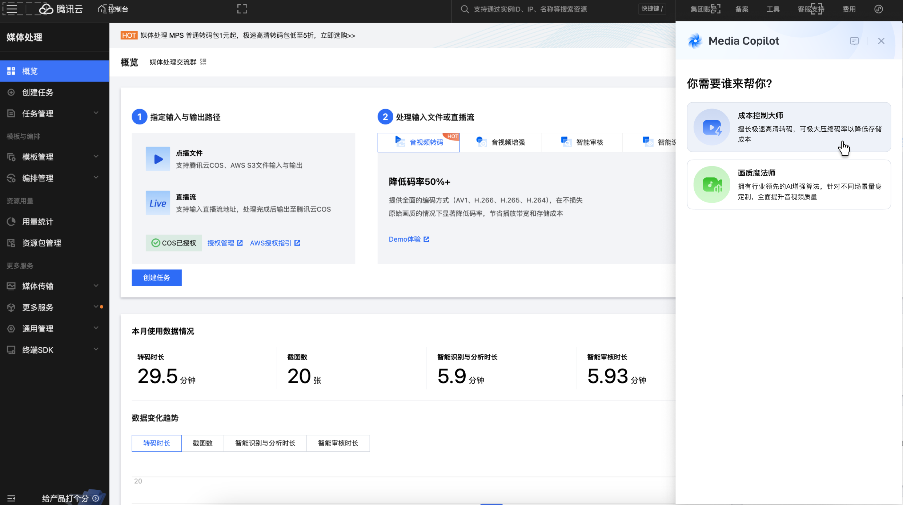
## 转码&增强助手
一期copilot提供两个助手（极速高清转码助手、音视频增强助手），分别仅支持创建极速高清、增强任务，其他任务不支持（包括普通转码、自适应转码也都不支持，copilot只能创建极速高清或者增强模板）。

一开始没有输入框，用户必须点击极速高清/增强两个卡片中的其中之一，进入转码或者增强助手中，然后才展示输入框，允许发送消息。
若还没发送新消息，用户可以点击右上角返回，切换转码/增强助手
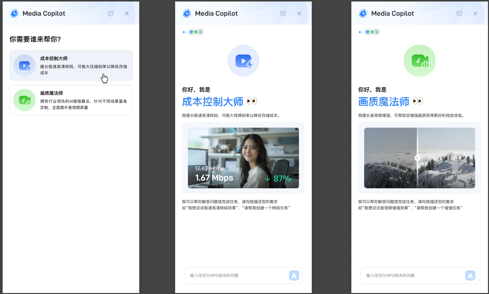
转码助手只能创建极速高清转码任务，若客户在转码助手的会话中要求发起增强或其他相关功能的任务，copilot回复需引导客户，例如：

很抱歉，我是极速高清转码助手，暂时只能创建极速高清转码任务，后续media copilot将会不断更新迭代，上线更多功能助手，敬请期待。

若您需要创建音视频增强任务，可以创建一个新会话，选择音视频增强助手。
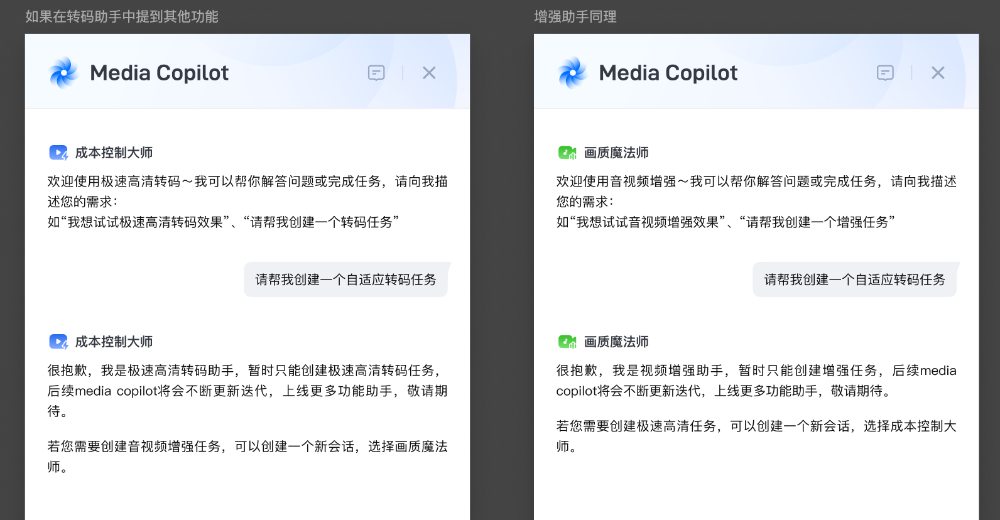
## 支持创建新会话、保存历史会话、删除会话操作

- 只有用户说了第一句话，此时才会创建一个新会话 保存消息内容。

- 若用户什么都没说，点击【创建新会话】，提示：当前已是最新对话

- 最新会话在历史列表最前面，展示【对话中】，不显示时间

- 历史会话title为第一句话，时间为最新一条消息发送的时间，时间最近的排前面
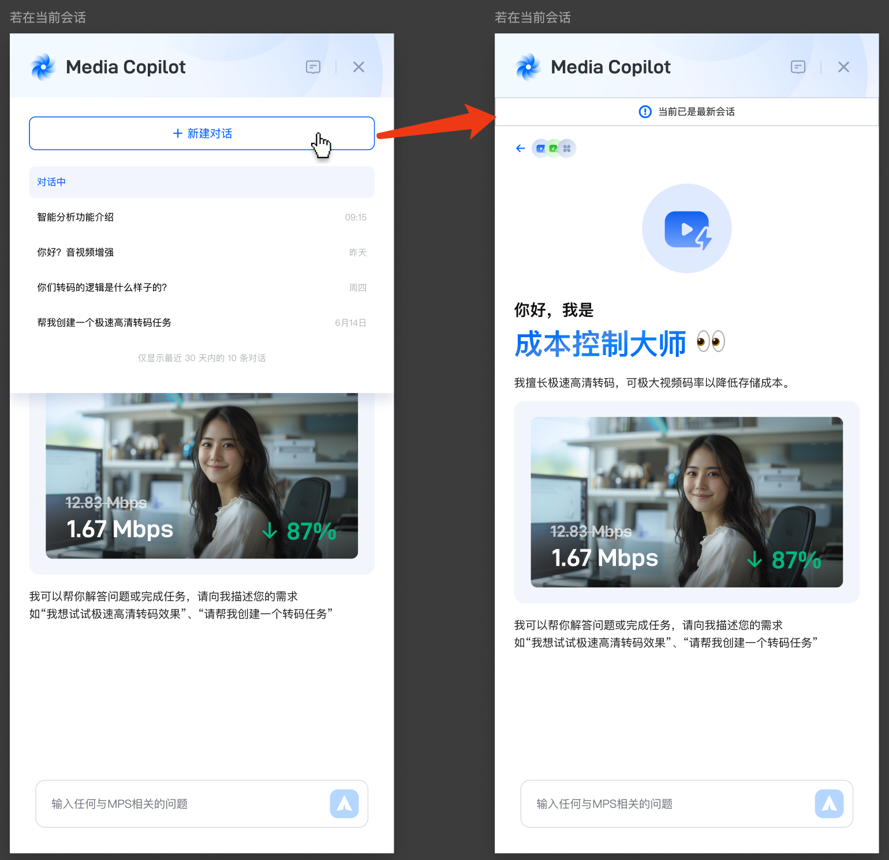
单个appid限制了10个会话的上限；

单个会话如果超过30天不活跃（即最后一次对话的时间在30天之前），自动删除。 但创建过的模板还会保留。

- 若历史会话超过了10个，用户点击创建新会话，自动删除最老的会话（但不会删除通过该会话创建的模板、编排等内容），无需提示。
- 也支持用户手动删除。鼠标hover至历史会话，显示删除按钮，点击直接删除会话
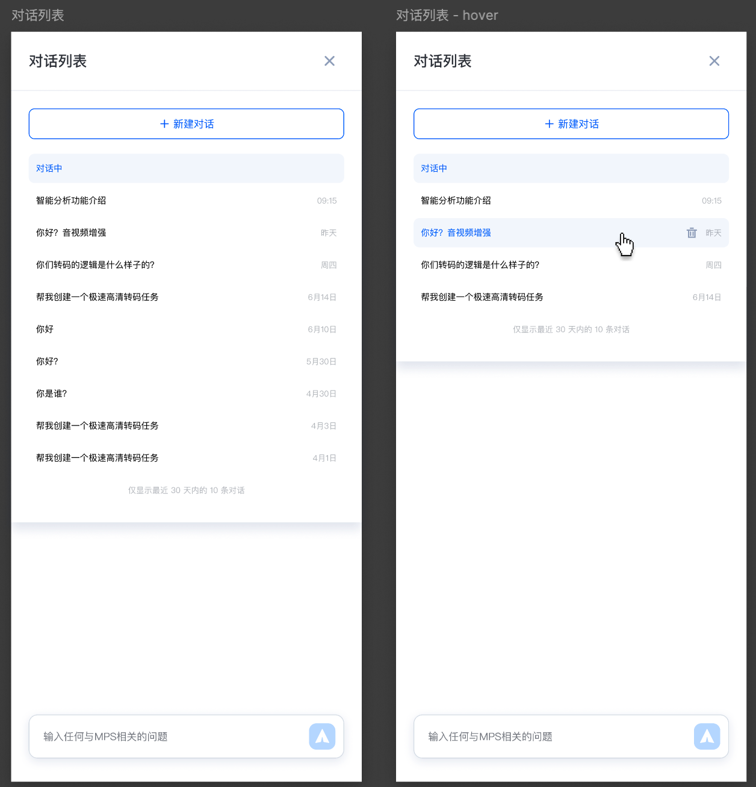
## 消息加载、错误处理细节

后台返回回复需要几秒时间，在收到回复前，前端展示加载中动态

- 加载过程中，虽然允许输入新消息，但发送按钮置灰，即便按回车也不发送新消息至后台，直到收到前一个消息的回复
- 若copilot生成回复失败，后台会返回错误码，前端根据错误码展示文案，例如：请求失败，请稍后再试。
- 若加载过程中，用户关闭copilot/创建新会话，弹窗提示。（待定，暂不需求该交互）
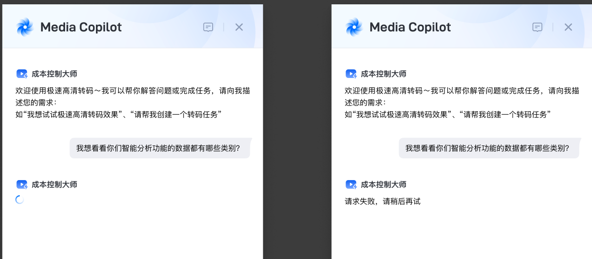
- 如果用户问了回答不了的问题（例如：CVM的计费说明），需要兜底回复，例如：
很抱歉，我还未学习到如何回答这个问题的内容，暂时无法提供相关信息。

- 如果用户说的话涉政、违规，报错：违规消息，请求超时
且禁用该会话，不允许发送新消息

- 会话中会创建模板，但每个用户能创建的模板数量有限制，若超过了模板数量，报错提示：
**模板数量超过限制，无法创建新模板，请先进入模板管理页面删除不需要的模板**
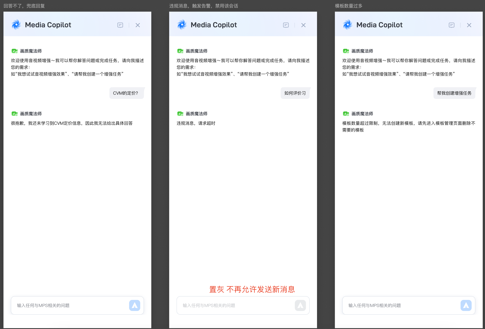

# 进入极速高清转码助手，开始创建任务流程

## 整体流程

点击成本控制大师，进入会话内，展示欢迎语，显示输入框

用户发送了第一句话，前端需要把展示语内容、返回按钮隐藏，避免用户在会话过程中切换助手。若用户要切换其他助手只能创建一个新会话
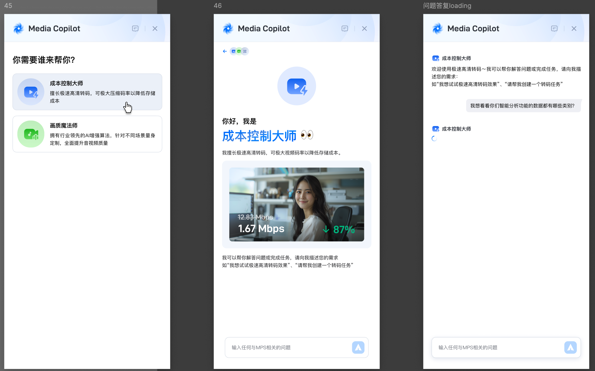
若用户发送一段模糊发起任务的操作，例如发送“请帮我创建一个极速高清转码任务”，后台会默认用四个预设模板直接处理视频。具体流程如下

1. 用户发送指令，例如“请帮我创建一个极速高清转码任务”
2. copilot要求用户上传视频，支持cos、URL、示例视频三种选择。为了避免打断对话，这期间对话框置灰，不允许发送自定义消息。
   - 若用户选择URL方式，显示特殊输入框仅允许填写URL，前端做个识别，不是URL格式就输入框变红 不允许发送。
3. 视频发送至copilot后，copilot快速处理30s，在加载期间，显示输入框，但不允许发送至copilot
4. 出 综合最优、极致压缩、码率最优、画质最优 四个结果，要求用户在四个结果中必须选一个最好的。为了避免打断对话，这期间对话框置灰，不允许发送自定义消息
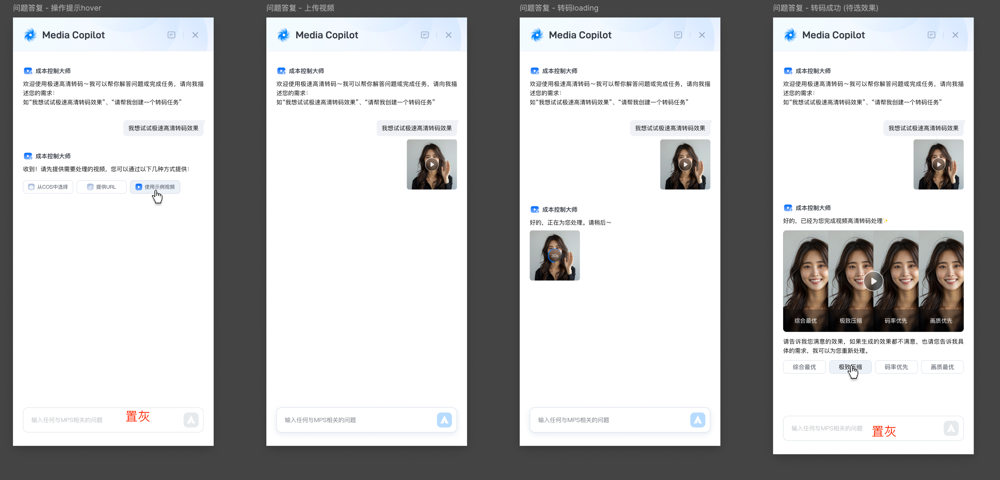
5. 用户选择一个相对更好的结果后，后台生成模板并把模板id返还前端。前端展示输入框，以及快速处理30s、完整处理、查看参数，三个常驻按钮，允许用户自定义输入消息。
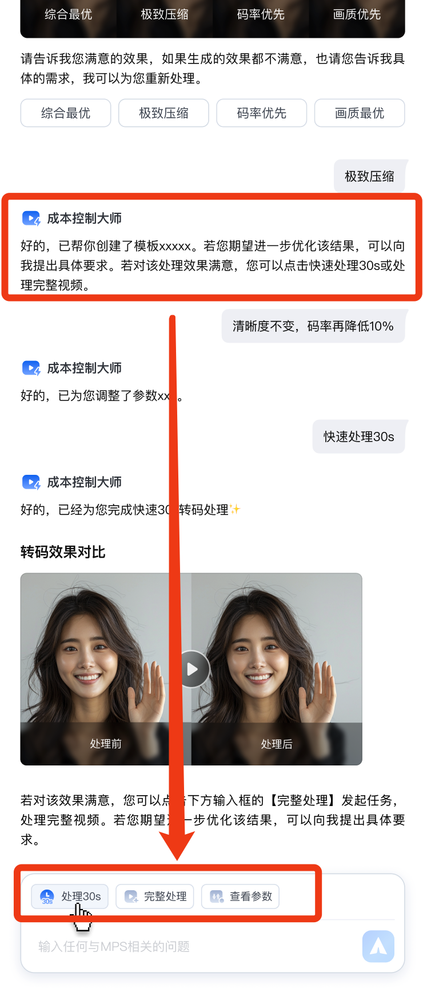
点击效果对比预览图，打开同屏对比（复用评测需求中做的同屏对比工具）

默认横屏一排展示
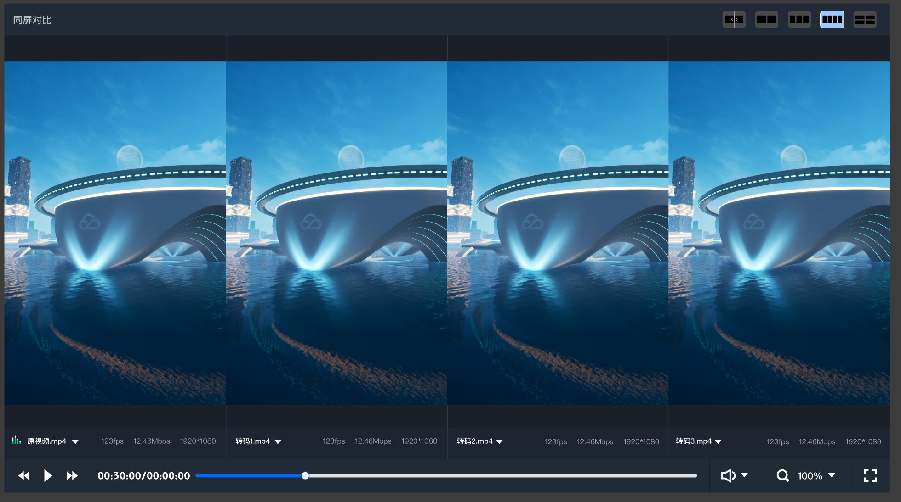
若用户发送一段比较清晰的指令，例如“我想要一个mp4格式，60fps的视频”，则仅创建极速高清模版，不直接发起任务。具体流程如下

1. 用户发送指令，例如“帮我把视频改成265编码，码率设置为5M，格式为HLS”
2. opilot识别客户需求，智能生成模板，并返回模板id给前端。前端拿到模板id，展示 快速处理30s、完整处理、查看参数 三个常驻按钮
3. 用户主动点击【处理30s】或者文案发出 帮我处理 之类的明确指令，copilot才会发起处理30s
4. copilot不使用4个预设模板，而是使用根据用户要求智能创建的模板处理出结果，前端展示预览图，点击可以打开同屏对比。
5. 用户通过自定义发送消息，继续优化模板参数，不断调优
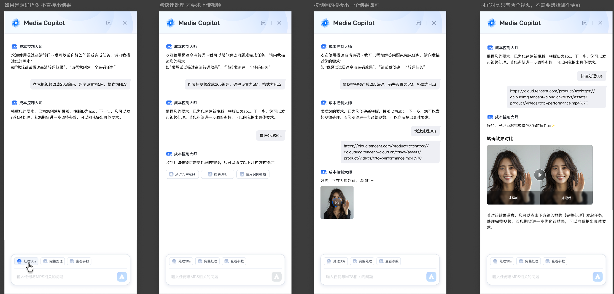

## 上传视频时的细节

### 若点击【从cos中选择】

- 若没有授权cos，先弹出服务授权弹窗
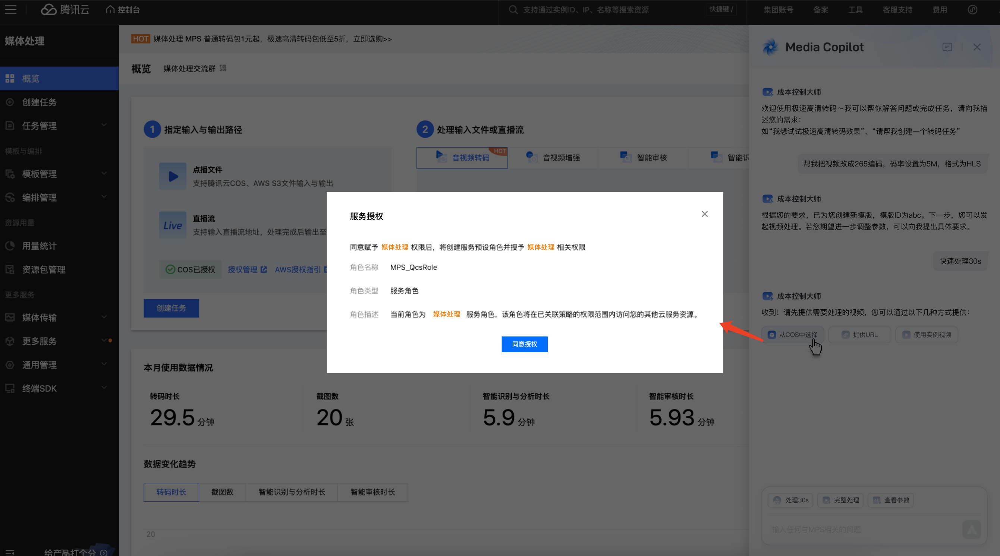
- 在弹出cos选择弹窗
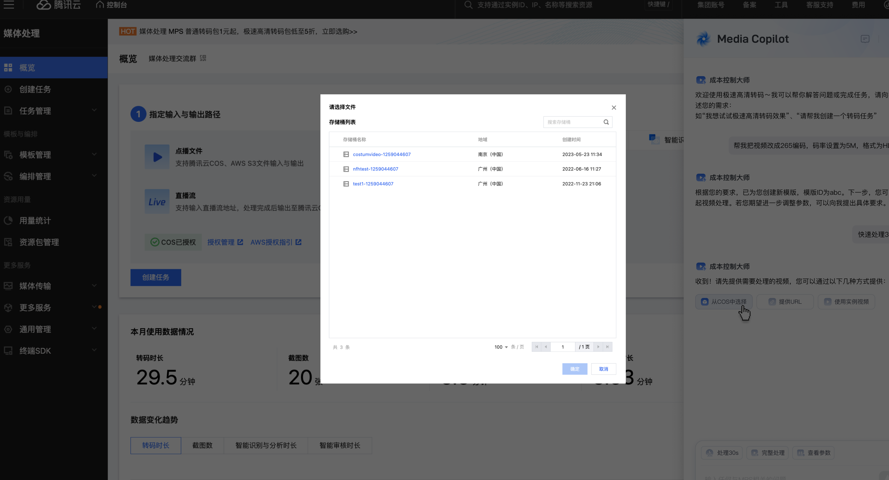
选择文件后，发送路径至后台。在等候copilot回复期间，前端提供文案提示：好的，正在为您处理，请稍后
- cos文件如果可以拿到视频封面，前端可以做一个30s倒计时的预览。如果拿不到就纯文案提示即可
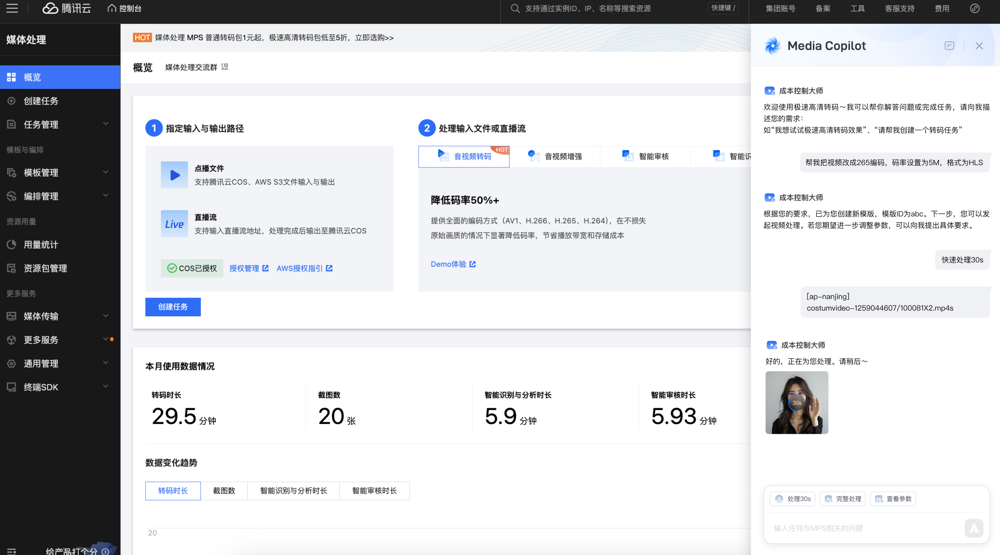

### 若点击【提供URL】

点击【提供URL】，输入框变蓝色聚焦态，清空输入的内容（如果有的话），要求输入URL。

前端简单验证下是不是URL格式，不是的话输入框变红，不允许发送消息。
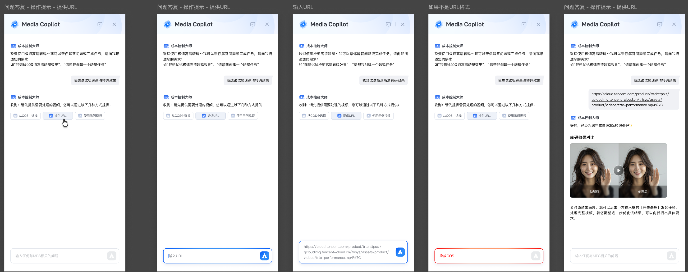

### 若点击【使用示例视频】

- 提供示例视频图片预览，点击播放视频，效果与 任务管理-播放源视频 一致。
- 示例视频URL：待提供
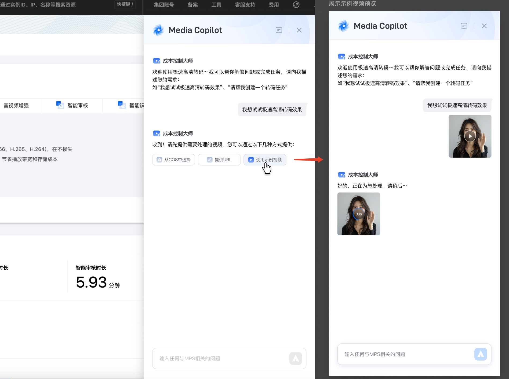

## 处理30s/完整处理/查看参数 操作细节

当前端收到后台返回的模板id，展示这三个常驻按钮。

常驻按钮样式如下：
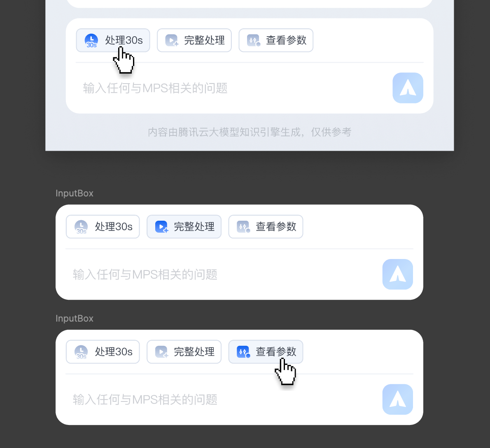

### 处理30s

若点击【处理30s】，则copilot按照创建的模板，再次处理30s，出对比预览：

### 完整处理

若点击【完整处理】，跳转至创建任务页面，前端填写上用户选择的cos文件/url地址，并将后台返回的模板id填至编排内

copilot中前端处理文案提示（关闭copilot后不再保留该文案）：

已为你自动配置创建任务页面，你可以根据需要调整配置，点击页面中的【立即处理】即可发起任务。发起任务后，将按照处理编排中的各功能进行收费
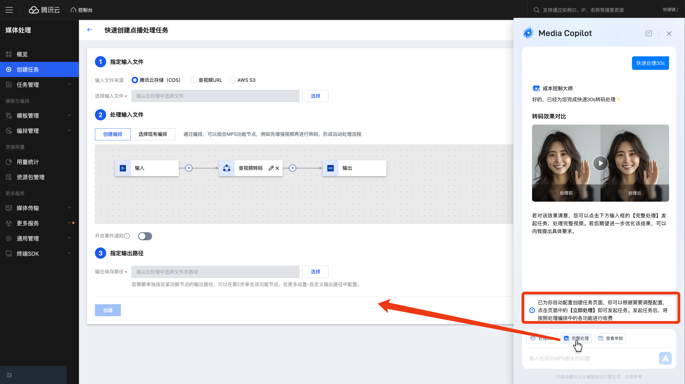
### 查看参数

点击【查看参数】，前端打开参数详情弹窗
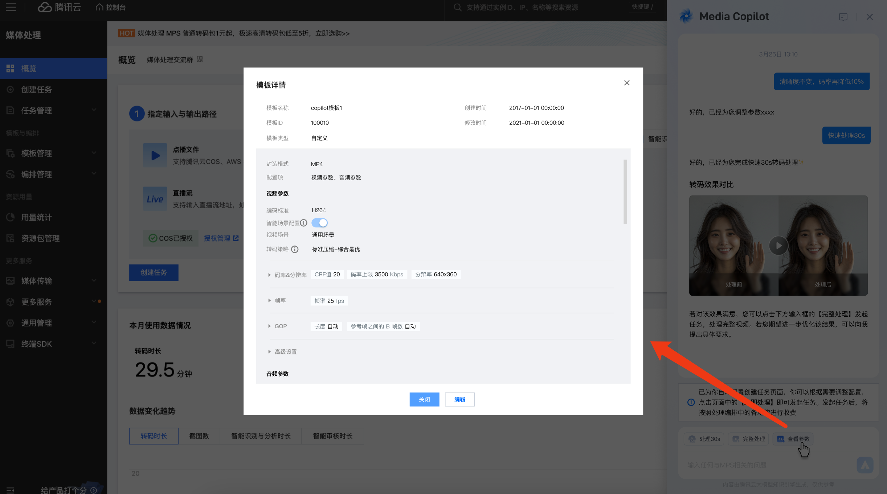
点击编辑，打开模板编辑页面
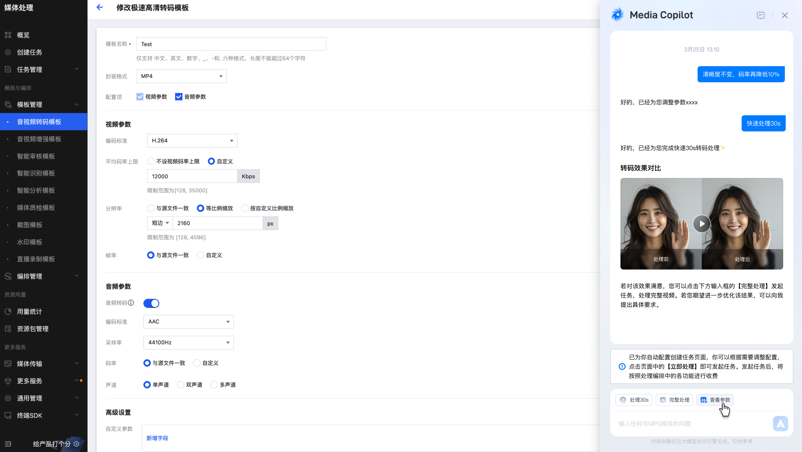

## 若用户创建了多个模板

copilot后台支持用户在一轮会话中创建出多个模板，若要求发起任务，后台会返回多个任务结果。因此前端需要处理两个点：

1、输出结果同屏对比，需要支持多个结果展示

前端收到后台返回的多个任务结果，打开同屏对比时，允许多个视频切换对比。

注意：后台返回的视频名称需要带上模板id，否则对比时很难跟前面的模板做关联。
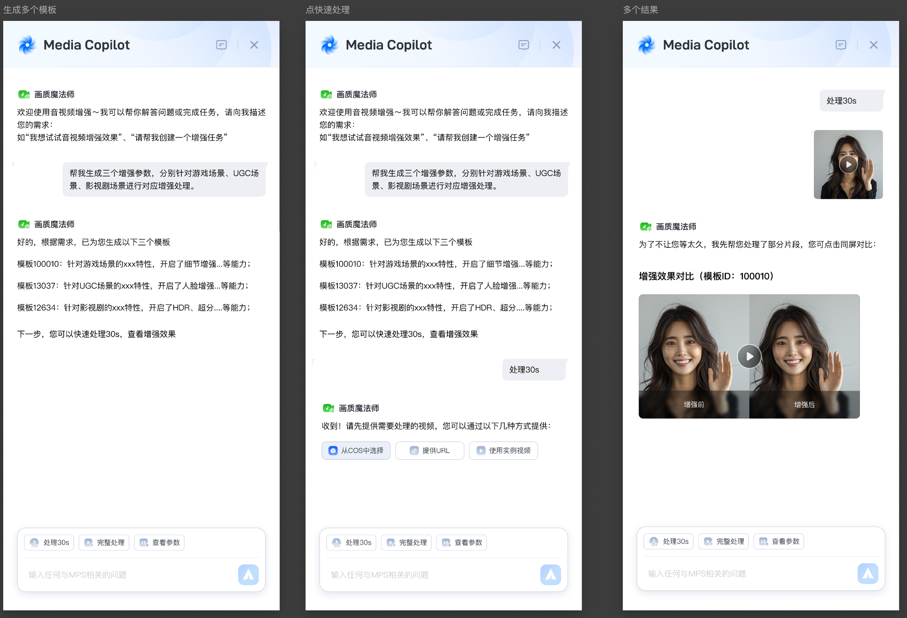
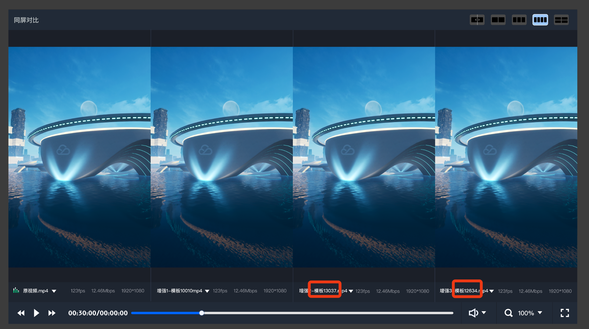

2、支持查看多个模板参数

若前面创建了多个模板，后台会返回前端多个模板ID，此时单击【查看参数】

弹窗先展示模板列表
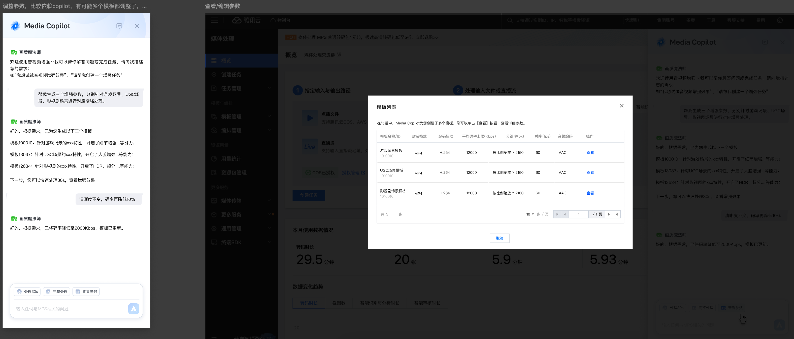
单击查看
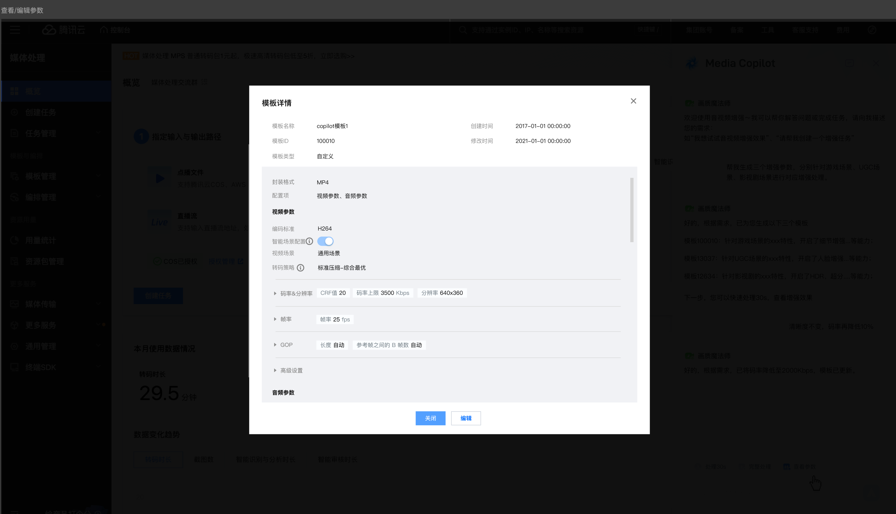

# 进入音视频增强助手

与转码助手类似，若是模糊发起任务的请求，用预设模板发起任务（但增强只有一个预设模板，不会出4个结果）

上传完视频后，先通过质检分析存在什么问题、属于什么视频场景，智能分析选择合适的参数

默认使用一个通用的增强参数

客户调整效果后创建新模板，前端拿到模板ID，展示常驻按钮
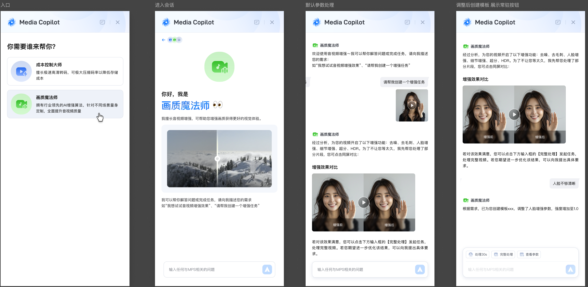

其他操作与前文转码一致

# 手动创建视频极速高清转码/普通视频转码/音视频增强任务
若客户在创建任务中，只选择了极速高清转码/普通视频转码/音视频增强 单个任务节点

当配置完了输入源、编排，出现【先看看处理效果】icon，单击后打开 快速处理 浮层，快速处理30s

这里不是打开copilot创建新会话，是单独的快速处理功能，无需保存历史会话
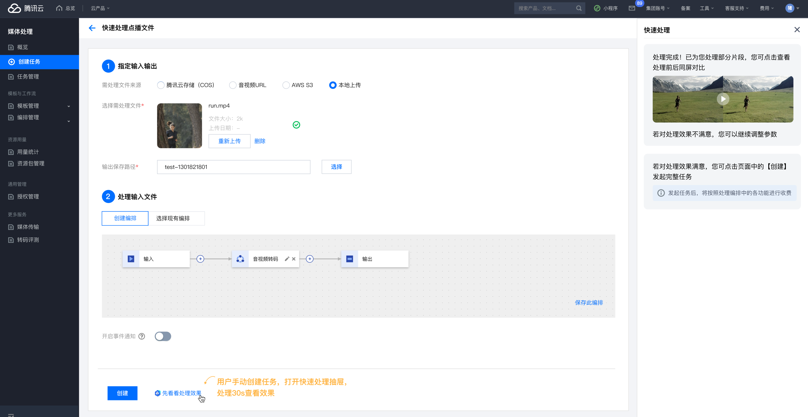

