一、【需求背景】
IBC 展会上会预留空间展示媒体处理声音克隆能力，具体展位的信息如图所示：
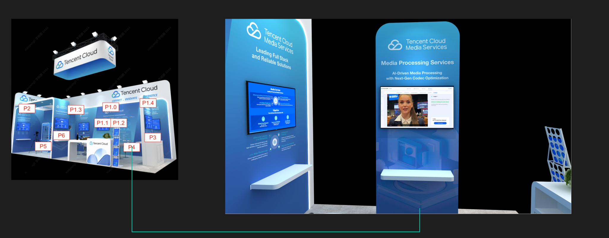
使用方式：在显示屏下方会接电脑，电脑通过数据线连接显示器，整体用户在电脑上完成操作。

二、【展会需求详情】（需求文字展示以视觉稿为准）
1.新增 AI Dubbing 界面，此界面和其他媒体 AI 的功能属于同一个 tab；整体界面为一个播放器，根据用户在右侧选择不同的语言来播放不同语言的视频；默认字幕为英文：

Welcome to the Tencent Cloud Media Processing Services at IBC, where you can experience extremely media processing technology and numerous AI applications in audio and video. 对应中文（欢迎来到 IBC 腾讯云媒体处理展台，在这里你将体验到极致的媒体处理技术和众多 AI 在音视频领域的应用）画面的右下角按钮名称：

Try it yourself；画面展示字幕。
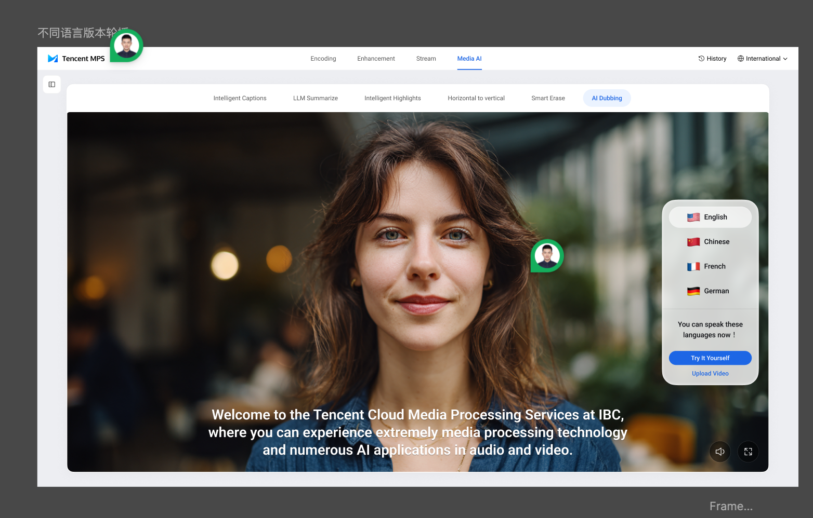
2.用户点击Try it yourself之后，首先跳转至腾讯云国际站的登录界面（和其他登录界面相同，视觉稿未展示），登录后先提示用户选择输入和输出语言，输入语言可选：中文、英语、法语、德语、西班牙语、葡萄牙语、日语、韩语、荷兰语，输出语言可选项为：总的可选语言类型-输入语言类型，即用户若选择输入语言为英文，则输入语言不支持选择英文；
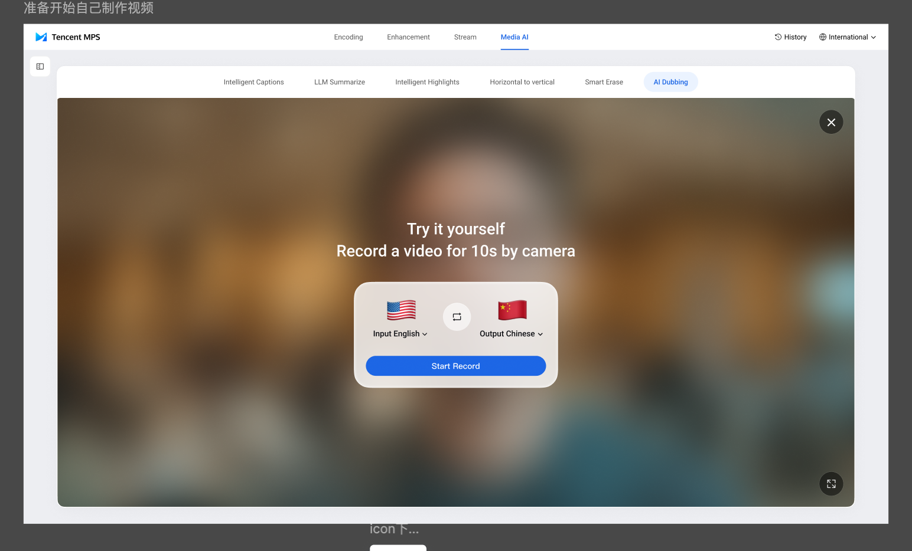
3.点击 start 之后，会显示录制开始倒计时的秒数并提示文案，文案内容：英文：I am very happy to attend the IBC exhibition. I am deeply impressed by Tencent Cloud Media Processing Services capabilities.（对应中文：我非常开心可以参加 IBC 展会，腾讯云媒体处理的能力给我留下的深刻的印象）；
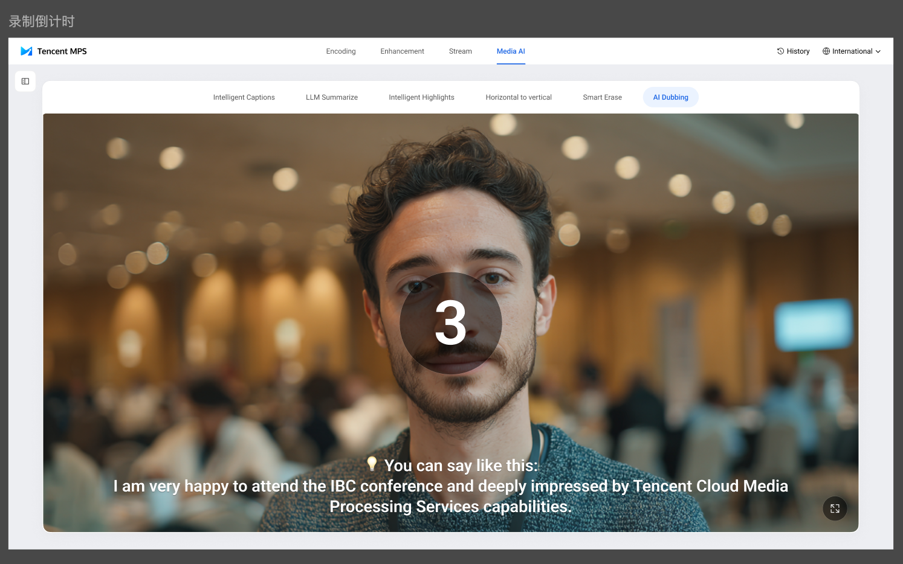
4.录制时画面上方会显示倒计时的秒数，提示用户剩余的录制时间，当10秒结束后，AI process 按钮会变蓝，引导用户点击 AI process 按钮；点击 Retry 按钮则返回第二步选择语言界面；
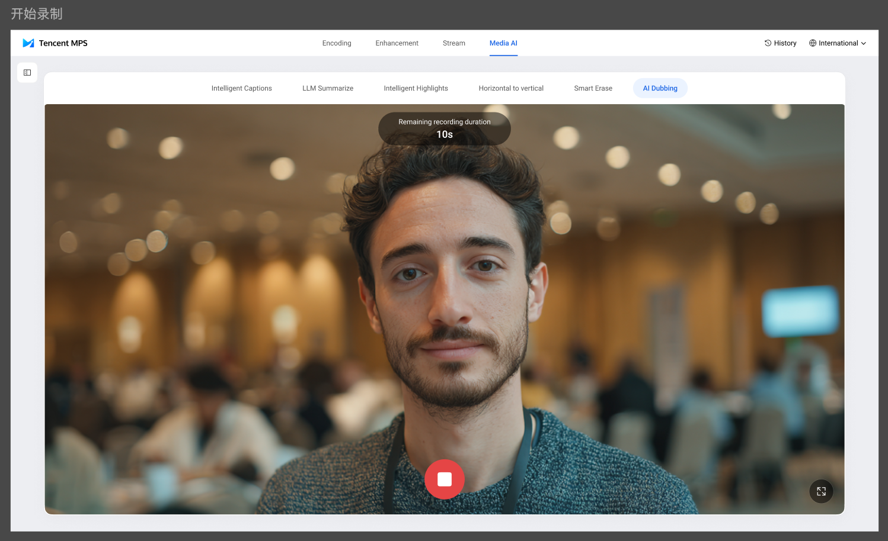
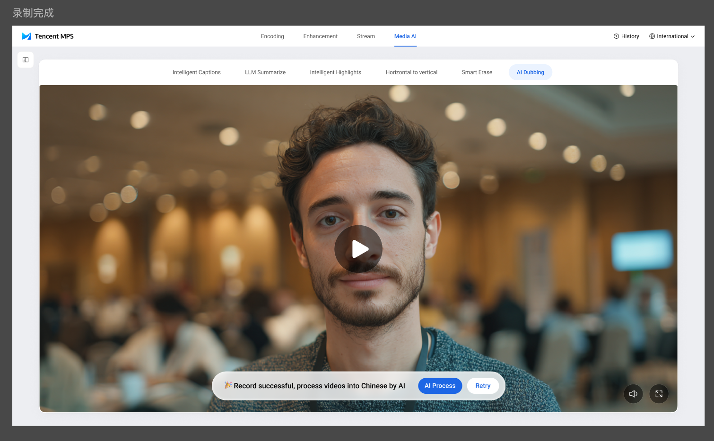
5.录制完成之后显示 AI 处理的过程，此处视觉效果可以更加突出智能化的感觉；处理完之后可以扫码查看，提供一个之后可以查看的入口；
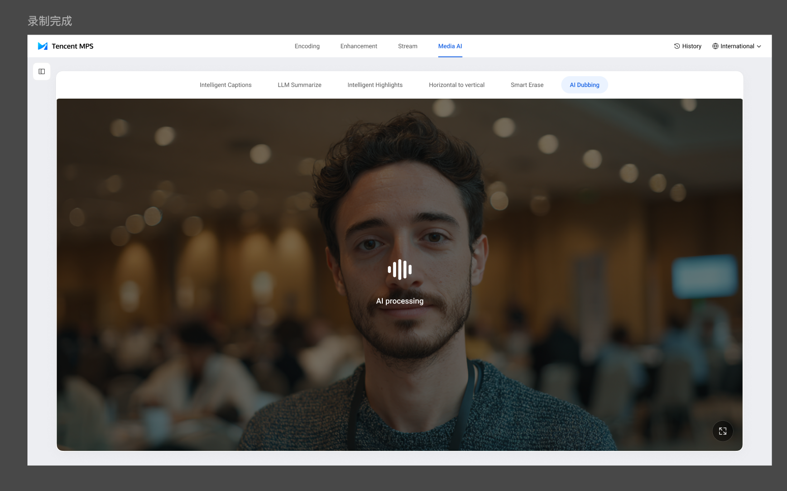
6.处理完成之后显示下载界面，下载方式有两种：用户输入邮箱后向用户的邮箱发送下载链接、用户扫描二维码之后下载；点击 quit 则返回至一开始视频展示的首页；
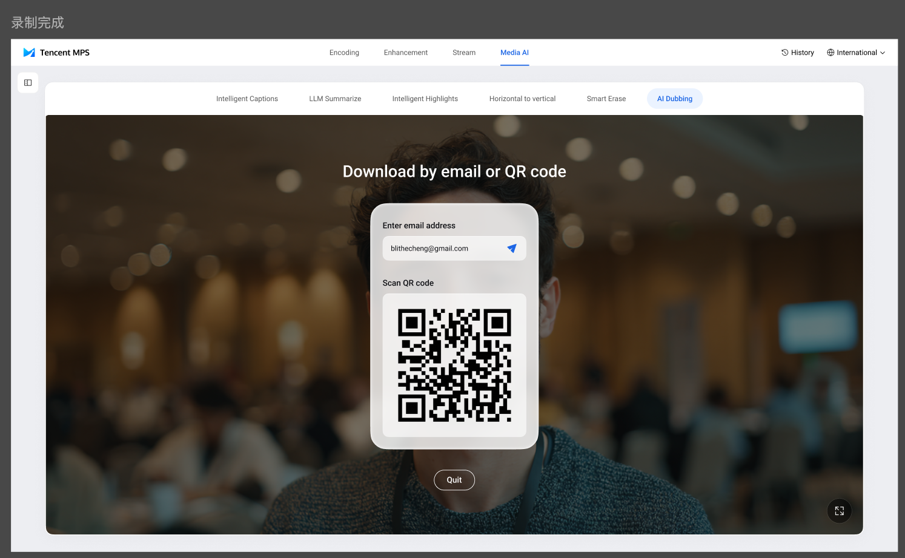
6.1用户输入邮箱后，待云端处理完毕后会自动向用户的邮箱发送下载邮件，在邮件中点击链接跳转后即可下载；
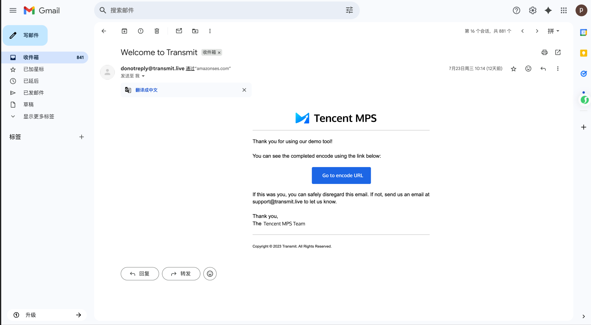
在下载界面同时还有删除按钮，作为对隐私的保护，我们为客户提供了删除按钮。
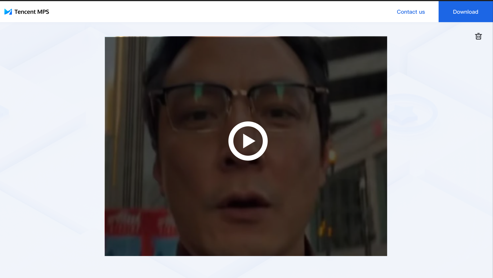
 6.2手机扫码之后展示的界面，也提供了下载按钮和删除按钮，如果用户选择下载后，则可以看到视频页面不存在；用户点击 contact us 后，则跳转至：https://mps.live/contact
 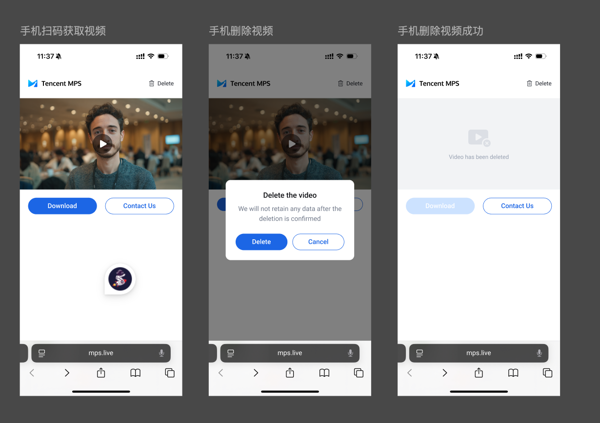
 