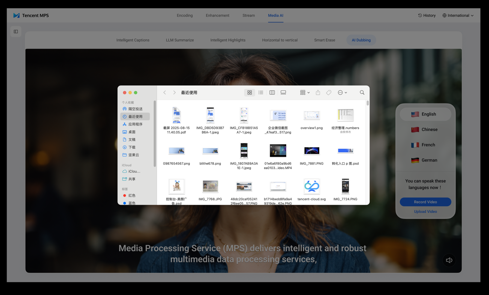
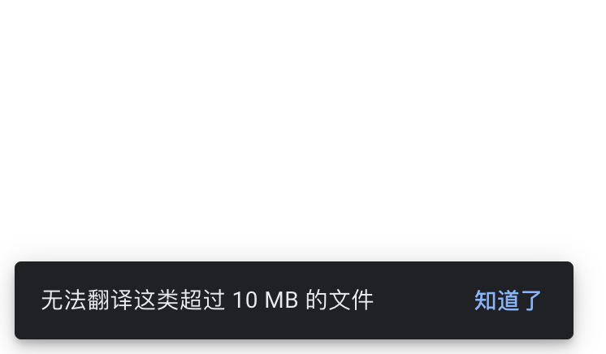
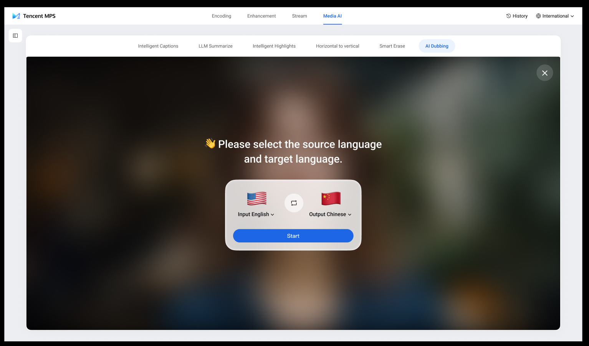
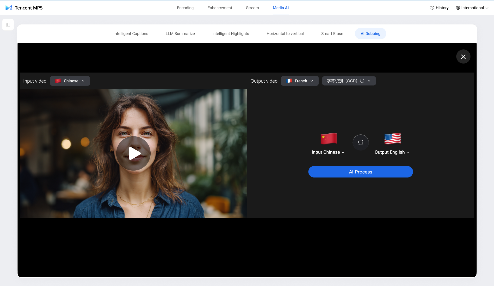
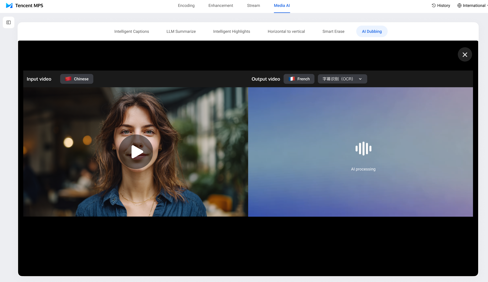
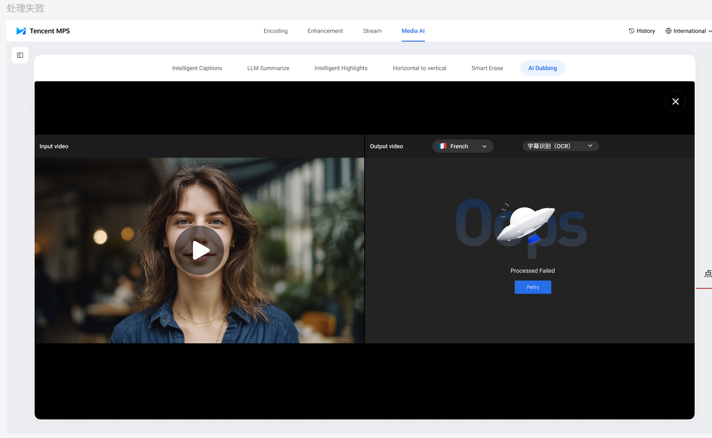
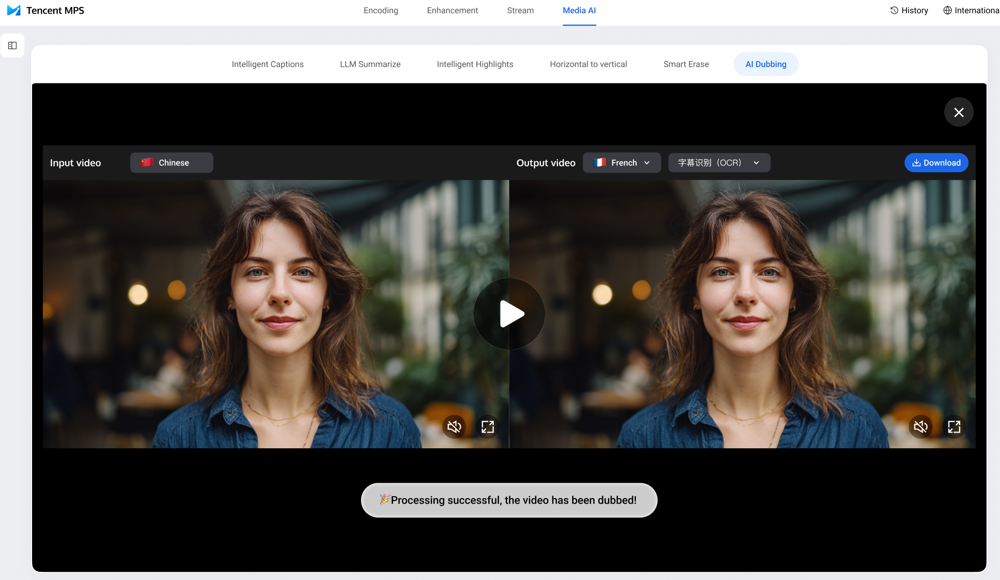
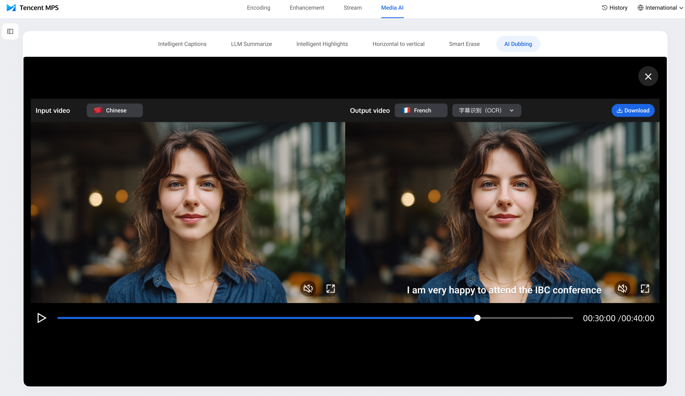

一、需求背景
AI Dubbing 能力在展会表现出色，因之前上线一期能力更聚焦于展会的互动体验，为方便客户自助体验我们的 Dubbing 产品能力，上线二期客户可自助上传文件体验 Dubbing 能力功能。

二、需求详情
1.增加“upload video”按钮，当用户点击后先跳转至腾讯云的登录界面，之后即弹出本地文件浏览器，供用户选择要处理的视频文件，目前支持的文件后缀有mp4和mov（用户只能在自己的本地文件浏览器选择 mp4和 mov 后缀的文件），文件限制为：时长≤5分钟，大小≤500MB；超过限制后提示如下图二，弹窗提示：

若文件大于500MB，提示：Uploaded file too large

若文件大于5分钟，提示：Uploaded file too long

文件点击上传后增加进度按钮，展示位置为 upload video 之后

2.用户上传完视频后，会展示新的界面供用户选择源语言和目标语言，如下图所示；

2.用户选择完源语言和目标语言后，同屏展示左右两个界面，左侧界面展示用户上传的视频，点击播放按钮可以预览；右侧界面展示用户已选择的信息并提醒用户点击 AI process，上方默认处理方式为 OCR，下拉框可选 ASR，两个选项后均有提示信息：

字幕识别 OCR 后的提示信息：If the uploaded video has subtitles, please select this processing method.

音频识别 ASR 后的提示信息：If the uploaded video does not include subtitles, please select this processing method; we will identify subtitles through audio.

英文模式下直接显示 OCR 和 ASR

语言选择只能在屏幕右侧进行，上方仅作展示

3.用户点击 AI process 后，屏幕会显示 AI 处理的动效；左侧画面上方栏一直展示 input video 和源语言；

处理失败的情况；

4.当 AI 处理完毕之后，会同屏显示处理前和处理后的视频，方便用户对比 Dubbing 效果；右上角展示 download 按钮，提示用户下载处理之后的视频；

5.点击播放按钮后，两个视频共用一个进度条，默认用户自己上传的视频静音；两个视频下方有静音按钮，可以选择单独聆听具体视频的声音；用户点击 download 按钮后，直接弹出浏览器的 download 能力；全屏按钮扔展示两个对比的视频。

编排目前不支持分析节点后接转码，故返回的视频由后端完成字幕的压制；关于原始字幕擦除的问题：如果用户选择 ocr 模式，则擦除字幕后将新的字幕压制在视频中；如果用户选择 asr 模式，则直接将字幕压制进视频（此部分提示已经在 information 中展示）。

三、白名单逻辑优化
1.目前一期的白名单逻辑不变，保留目前白名单用户的 uin：200043250083 和 uin：200038858852，这两个 uin 在展会上使用，检测到是这两个 uin 发起的任务后用户扫码下载不用登录；如果不在白名单，扫码后需要登录才能下载；

2.二期增加单个 uin 处理任务数量的限制，录制和上传视频总共处理10个视频的上限，当超出此限制后，则无法处理 Dubbing 任务；但白名单用户则不受任务数量的限制，目前白名单用户和一期一致，后期由@jojoxiang(向朝阳)动态维护。

根据 uin 来判断用户是否是白名单用户，保留目前白名单用户的 uin：200043250083 和 uin：200038858852。

做以下逻辑的处理，假设白名单用户为 A，普通正常登录用户为 C；一期场景为录制，二期场景为上传视频：

1.当检测到 uin 为 A 时：录制场景，扫码下载时不用登录腾讯云账号即可下载；history 中也不展示 A 的 task 信息；

2.当检测到 uin 为 A 时：上传视频场景，history 中也不显示 A 的 task 信息；

3.当检测到 uin 为 C 时：录制场景，扫码下载时要登录；history 中不显示 task 信息；

4.当检测到 uin 为 C 时：上传视频场景，history 显示 C 的 task 信息。

四、参考设计资料
https://www.figma.com/design/uR1oOB5gQVr7T2jIOuRhdd/%E5%AA%92%E4%BD%93%E5%A4%84%E7%90%86%E6%B5%B7%E5%A4%96%E7%8B%AC%E7%AB%8B%E7%AB%99?node-id=7533-2044&p=f&t=WtbooGeUp7YV0J00-0

五、11月12沟通细节
1.录制和上传视频总共处理10个视频的上限；

2.当Dubbing 任务超过处理限制后弹窗提示“This exceeds the maximum number of processure per account.”。

六、11月24日需求更新
保留目前 task history 的逻辑。

1.针对展会账号（白名单）账号，录制不保留 task history，本地上传保留 task history；

2.除白名单账号外的其他账号，录制和上传文件均保留 task history；

3.二期上传文件下载逻辑和目前一致，增加 task history，点击后可返回同屏对比界面。

增加泰语的选择：录制和上传文件的语言增加“泰语”，输出语言不增加泰语，和现在保持不变。

前端加字段来提示后端是录制还是本地上传文件。

下载文件名称的命名规范：Dubbed Video-TaskID

中文站同步上线。

左侧导航栏文案：

Experience the features

Upload your file——上传完文件标志为已完成

Choose input&output language——选择完输入输出语言标志为已完成

AI process——点击 AI process 后标志为已完成

Download——点击 Download 后标志为已完成

Use the Console——保持不变

七、需求待优化点
1.录制模式下取消人声识别的步骤，减少 Dubbing 的处理时间@jojoxiang(向朝阳)；
2.后期 Dubbing 的供应商修改后，独立站上的处理模型也做相应的优化，减少 Dubbing 的处理时间@jojoxiang(向朝阳)。

