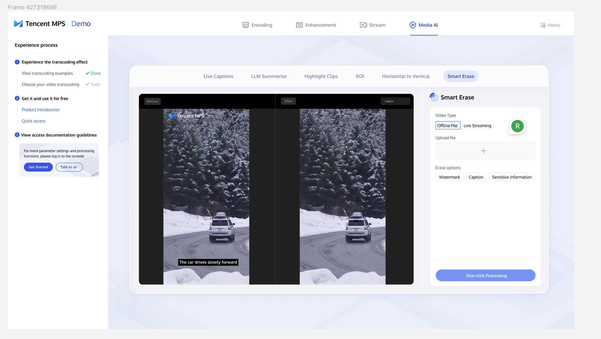
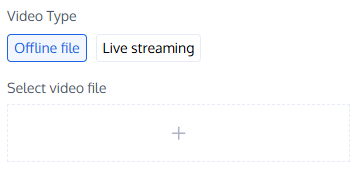
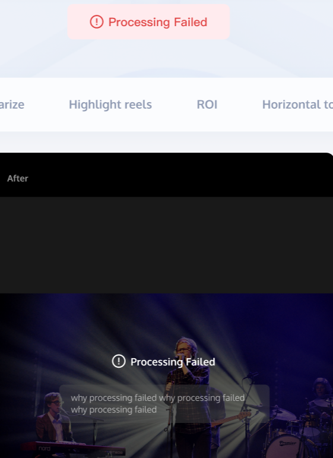
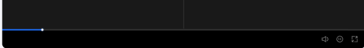
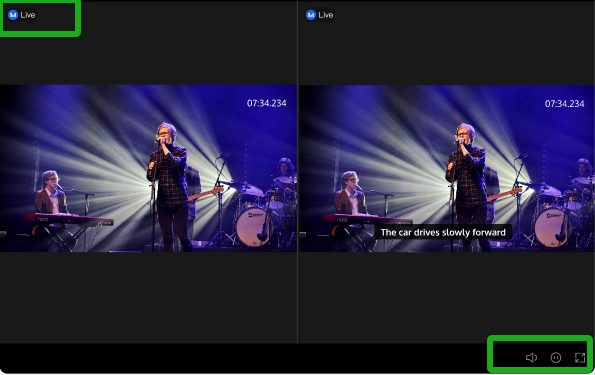

1. 右侧工具栏组件中，选择内容源保持与之前一致：Video Type（Offline File / Live Streaming）、Select video file / Fill in the live streaming address

默认情况下，播放默认视频时，不选择Video Type

2. Erase Options为单选，选项包括：Watermark、Caption、Sensitive Information

3. 只有选择Video Type、提供内容源、选择Erase Options后，One-Click Processing从不可点击状态变为可点击状态

4. 播放器平分为两屏，左边放原视频（标记为：Before），右边为处理后的竖屏视频（标记为：After）。并且右上角会展示当前选择的擦除类型：Watermark / Caption / Sensitive Information，此信息仅做展示，不可点击和修改。

5. 处理中和处理失败的样式，保持和之前的demo一致：

6. 对于离线文件，提供以下组件：进度条、静音/解除静音、播放/暂停、全屏

7. 对于直播流，提供以下组件：直播中的标识、静音/解除静音、播放/暂停、全屏

暂时不支持直播，后面再单独排。

类型选择：需要提供图片示例，帮助用户进行选择。

水印擦除：模型支持了16种类型；字幕擦除：画面中包含字幕；敏感信息擦除：支持车牌和人脸。

补充风险提示和声明