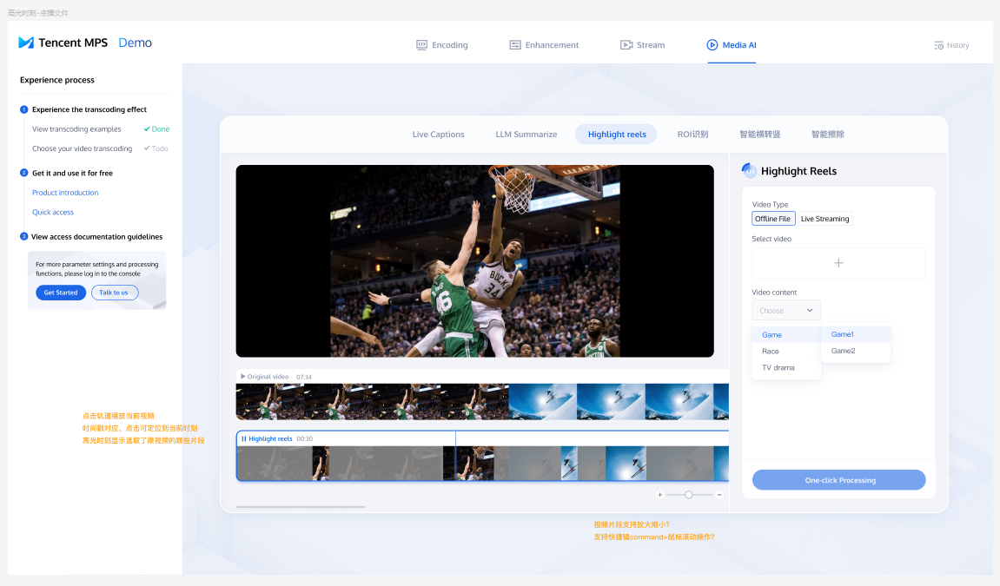
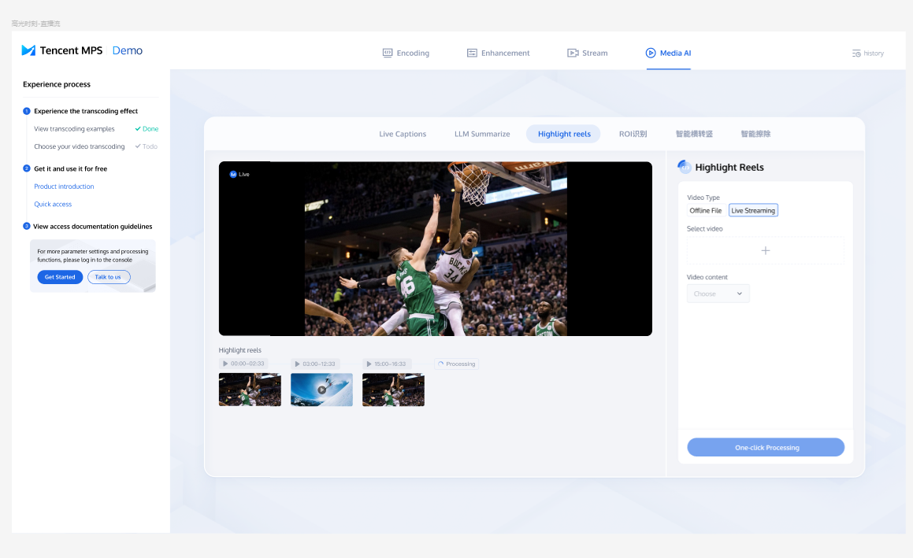
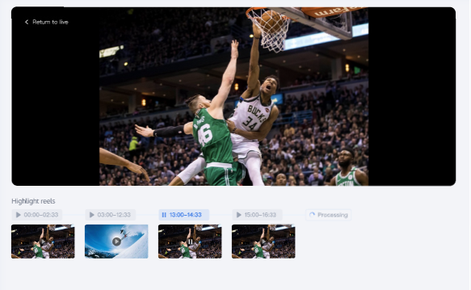
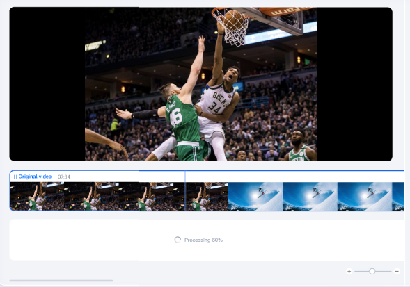
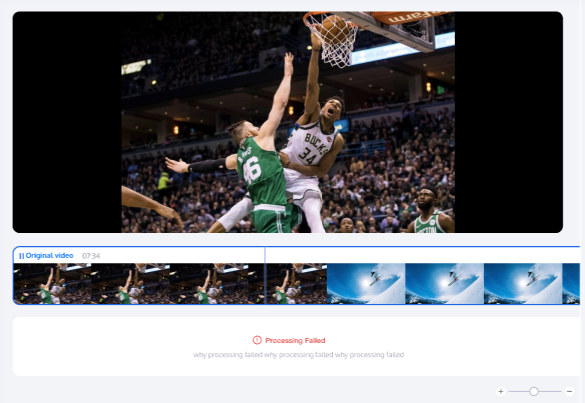

设计稿参考：

https://www.figma.com/design/uR1oOB5gQVr7T2jIOuRhdd/%E5%AA%92%E4%BD%93%E5%A4%84%E7%90%86%E6%B5%B7%E5%A4%96%E7%8B%AC%E7%AB%8B%E7%AB%99?node-id=5932-4403&node-type=frame&t=cbNuS7jq7JNFp6sM-0

1. 右侧工具栏配置信息：

1）Video type 和 Select video，和之前的demo用的是一样的组件

2）Video content：

第一级：综艺/影视

第一级：体育赛事；第二级：足球、篮球

第一级：游戏赛事；第二级：王者荣耀、王者荣耀竞赛、英雄联盟

第一级：背景音识别

2. 点播视频：高光集锦

1）播放器：播放器可以播放原视频 / 高光集锦，由用户点击相应轨道上的播放按钮控制。

2）原视频：轨道上展示相应时刻的截图

3）高光集锦：轨道上展示相应时刻的截图，高光时刻用彩色图片表示、非高光时刻用灰色图片表示。播放时会默认跳过灰色片段，仅播放彩色片段。

4）可以通过【+】、【-】来拉长或者缩短视频轨道，原视频和高光集锦会被同步拉长或者缩短

3. 直播流：高光集锦

1）播放器：默认播放直播，用户可以通过点击高光集锦的播放按钮切换到播放高光片段。播放高光片段时，播放器上有按钮可以返回直播画面。

2）高光集锦：每个高光片段对应是一个时间组件（开始时间、结束时间、播放/暂停按钮）、一个画面截图。直播未结束时，右侧会展示processing。

4. 处理中、处理失败的展示样式：

